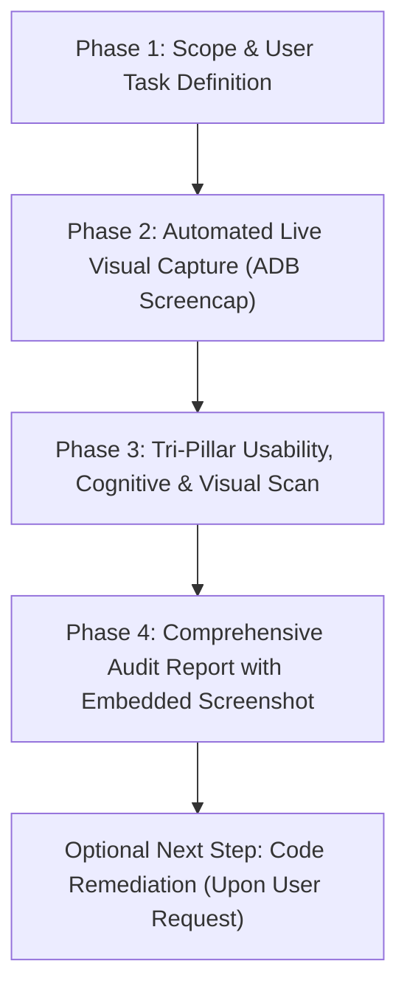

# 🚀 Screen UX Audit & Diagnostic Workflow

This workflow standardizes how user interface screens, modals, and user flows are systematically **audited, diagnosed, visually inspected, and scored** using the unified suite of HCI and behavioral frameworks:
1. **Jakob Nielsen's 10 Usability Heuristics** ([`usability-heuristics`](file:///c:/Users/Khaled/Khaled%20Dask/app/fitnes-my-app/.agents/skills/usability-heuristics/SKILL.md))
2. **Ben Shneiderman's Eight Golden Rules** ([`eight-golden-rules`](file:///c:/Users/Khaled/Khaled%20Dask/app/fitnes-my-app/.agents/skills/eight-golden-rules/SKILL.md))
3. **The Laws of UX & Mobile Touch Ergonomics** ([`laws-of-ux`](file:///c:/Users/Khaled/Khaled%20Dask/app/fitnes-my-app/.agents/skills/laws-of-ux/SKILL.md))
4. **The Fogg Behavior Model ($B=MAP$)** ([`fogg-behavior-model`](file:///c:/Users/Khaled/Khaled%20Dask/app/fitnes-my-app/.agents/skills/fogg-behavior-model/SKILL.md))
5. **Automated Real-Device Visual Inspection (ADB Screencap & Visual Analysis)**

---

## 🎯 Primary Purpose: Fast Diagnostic Audit First

> **Core Rule:** The primary objective of this workflow is **deep diagnostic auditing, visual inspection, and clear reporting**. 
> It analyzes the screen, captures real-device screenshots, identifies usability friction points, scores severity, and provides an actionable remediation plan **without altering code until the user explicitly requests it**.

---

## 📋 Standard 4-Phase Audit Execution Protocol



---

### 🔹 Phase 1: Scope & User Task Definition
Establish the user journey and context:
1. **Target Component/Screen:** Exact file path (e.g., `components/gym-owner/gym-enroll-member-modal.tsx`).
2. **Target User Persona:** Gym Owner, Front-Desk Staff, Coach, or Member.
3. **Core Job-to-be-Done (JTBD):** What primary objective is the user trying to achieve?

---

### 🔹 Phase 2: Automated Live Visual Capture (ADB Screencap & Full-Page Stitching)
When Android Emulator or connected device is active:
1. **Smart Before vs. After Lifecycle:**
   - **Initial Audit:** Captures live screen to `screenshots/<screen-name>-before.png` (and full-page `<screen-name>-before-full.png`).
   - **Re-Audit (Post-Fix Verification):**
     - Retains previous baseline as `screenshots/<screen-name>-before.png` / `-before-full.png`.
     - Captures remediated screen to `screenshots/<screen-name>-after.png` / `-after-full.png`.
     - Automatically renders a side-by-side **Before vs. After Visual Comparison Table** in the walkthrough/report.
2. **Single Viewport Capture Command:**
   ```bash
   adb shell screencap -p /sdcard/screen.png && adb pull /sdcard/screen.png "screenshots/<screen-name>-live.png"
   ```
3. **Full-Page Stitched Capture Command (For Long Scrollable Screens & Modals):**
   ```bash
   powershell -ExecutionPolicy Bypass -File scripts/capture-full-screen.ps1 -Slug "<screen-slug>" -Frames 3 -Suffix "before"
   ```
   *Note: Automatically captures multi-frame viewports via smooth scrolling and stitches them into a single high-resolution top-to-bottom vertical image.*
4. **Multi-Modal Visual Inspection:** Directly inspect the full-page image to evaluate:
   - Real-world font scaling, legibility, and contrast across all scrolled sections.
   - Pinned vs scrolled button ergonomics (Fitts's Law / Thumb Reach).
   - Spacing density, itemized calculations, and layout rhythm.

---

### 🔹 Phase 3: Quad-Pillar Inspection Protocol

#### Stage 3A: Free Exploratory Walkthrough
- Test edge cases, empty states, and offline behavior.
- Validate Dark Mode and Light Mode rendering.

#### Stage 3B: Systematic Quad-Pillar Checklist

##### 🏛️ Pillar 1: Usability Heuristics & 8 Golden Rules Scan
- [ ] **Status Feedback (H1 / Rule 3):** Immediate tactile/visual feedback on every tap? Async operations accompanied by skeleton loaders and disabled button states?
- [ ] **Real-World Mental Models (H2 / Rule 1):** Terms natural and free from database jargon? Local currency (`৳ BDT`) and dates formatted?
- [ ] **Emergency Exits & Freedom (H3 / Rule 6):** Can sheets, drawers, and modals be dismissed via swipe-down, Esc, or cancel buttons?
- [ ] **Consistency & Standards (H4 / Rule 1):** Universal color tokens (`#89FE00` for active/paid, `#FA5252` for dues, `#4DABF7` for frozen) maintained?
- [ ] **Error Prevention & Smart Constraints (H5 / Rule 5):** Numeric keyboards for amounts/phones? Occupied/unavailable items disabled?
- [ ] **Recognition over Recall (H6 / Rule 8):** Are recent options, totals, and previous step choices visible without memorization?
- [ ] **Constructive Error Recovery (H9 / Rule 5):** Do error alerts explain what happened and suggest how to fix it?
- [ ] **Closure & Guidance (H10 / Rule 4):** Does completion provide psychological closure, celebratory feedback, and a clear success summary?

##### 🖐️ Pillar 2: Laws of UX & Mobile Touch Ergonomics Scan
- [ ] **Hick’s Law (Decision Speed):** Are primary options kept to $\le 5$? Is the recommended option clearly distinguished by badge/accent?
- [ ] **Fitts’s Law & Touch Sizing (Hoober):**
  - Interactive touch targets at least **44×44 pt / 48×48 dp**?
  - Small icons ($<32\text{dp}$) have `hitSlop` virtual expansion?
  - Primary CTA pinned to the **natural bottom thumb zone**?
  - Whole cards and list rows clickable (whole-region clickability)?
  - At least **16dp safe-area margin** from the physical glass edges?
- [ ] **Miller’s Law & The Chunking Principle:**
  - Forms chunked into groups of 3–4 items (Nelson Cowan)?
  - Phone numbers formatted with spacing (`+880 1711-234567`)?
  - Dashboard metrics clustered into max 4 key KPI tiles per row?
- [ ] **Peak-End Rule:** Key milestones celebrated with haptics and 1-tap receipt sharing without secondary dilution?

##### 🧠 Pillar 3: Cognitive Load & Fogg Behavior Model ($B=MAP$)
- [ ] **Zero Mental Arithmetic:** Does the system calculate all discounts, locker fees, pro-rated balances, and total dues live on screen?
- [ ] **Icon + Label Standard (NN/g):** Are all standalone icons accompanied by descriptive text labels?
- [ ] **Simplicity Chain Check (BJ Fogg):** Time (<3 taps), Brain Cycles (no guessing), Physical Effort (thumb reach).
- [ ] **Doherty Threshold (<400ms):** Immediate optimistic UI update or skeleton loader displayed if an API call takes $>400\text{ms}$?

##### 🎨 Pillar 4: Pixel-Level Visual Aesthetics & Layout Rhythm
- [ ] **Color Contrast:** Text and badges easily readable against dark/light card backgrounds.
- [ ] **Visual Hierarchy:** Primary headers, badges, and pricing cards stand out without fighting for attention.
- [ ] **Micro-Feedback Affordances:** Glowing status orbs, subtle border accents, and haptic feedback on active rows.

---

### 🔹 Phase 4: Comprehensive Audit Report (Output Format)

Generate a clean markdown report embedding the captured screenshot and using the **4-Part Standard** (`When`, `What`, `Where`, `How/Why`) and **Nielsen 0–4 Severity Scale**:

```markdown
# 📋 UX Diagnostic Audit: [Screen / Modal Name]

## 📸 Live Screen Snapshot


### 🔄 Before vs. After Visual Comparison (Upon Re-Audit)
| 🔴 Before Fix | 🟢 After Fix |
|:---:|:---:|
|  |  |

## 📊 Executive Summary
- **Target Component:** `[File Path]`
- **User Persona & JTBD:** [Persona] — [Goal]
- **Overall Usability Health Score:** [e.g., 8.2 / 10]
- **Total Issues Found:** [Count] ([X] Catastrophe, [Y] Major, [Z] Minor, [W] Polish)

## 🔍 Detailed Findings (4-Part Standard)

| # | Pillar & Rule Violated | Location / Element | Issue Description (What, When, Where, How) | Severity (0-4) | Recommended Fix |
|---|---|---|---|---|---|
| 1 | Fitts's Law / Touch Sizing | Delete Action | Icon is only 18px with no hitSlop, causing high mis-tap rates | 3 (Major) | Expand touch target to 48x48dp with hitSlop |
| 2 | Cognitive Load / Zero Math | Plan Selector | Owner must manually add locker rent to membership fee | 2 (Minor) | Display real-time auto-calculated live total |
| 3 | Visual Contrast / Aesthetics | Expired Badge | Subtitle text has low contrast on dark surface | 1 (Polish) | Increase opacity or use brighter muted token |

## 🛠️ Prioritized Remediation Action Plan
1. **[P0 - High Priority]** [Critical fix item]
2. **[P1 - Medium Priority]** [Major fix item]
3. **[P2 - Polish]** [Cosmetic improvement item]
```


