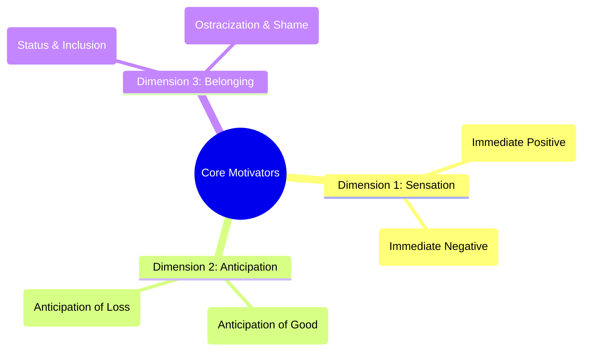
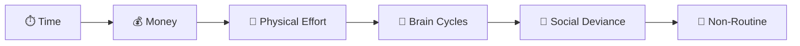
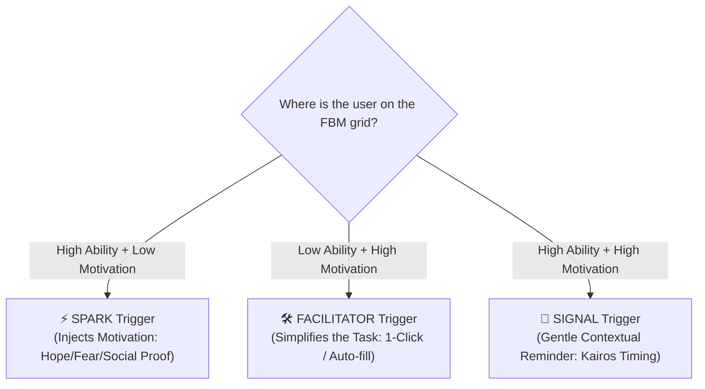

# 🎯 The Fogg Behavior Model (FBM): Persuasive Design & Habit Architecture

A canonical behavioral engineering framework developed by **Dr. BJ Fogg** at the **Stanford Persuasive Technology Lab** (ACM 2009). The model provides a systematic, scientific method to understand, activate, and automate human behavior in digital products.

---

## 📐 The Universal Behavior Formula: $B = MAP$

$$\mathbf{B} = \mathbf{M} \times \mathbf{A} \times \mathbf{P}$$

$$\text{Behavior} = \text{Motivation} \times \text{Ability} \times \text{Prompt (Trigger)}$$

> **Core Axiom:** For a target behavior to occur, a person must have **sufficient Motivation**, **sufficient Ability**, and an **effective Prompt (Trigger)** *at the exact same instant*. If any one of these three factors is missing or below the threshold, the behavior will not happen.

```
High ▲                [Above Action Line: Behavior Succeeds]
     │                 ★ Target Behavior Happens (with Prompt)
     │                . 
M    │               .  Action Line (Activation Threshold)
O    │              .
T    │             .
I    │            .
V    │           .
A    │          .
T    │         .
I    │        .
O    │       .
N    │      .
     │     .
Low  ▼    .___________ [Below Action Line: Behavior Fails]
         ◀───────────────────────────────────────────────▶
         Hard to Do (Low)        ABILITY        Easy to Do (High)
```

---

## ⚡ The Trade-off: Motivation vs. Ability

1. **High Motivation Compensates for Low Ability:**
   - If motivation is extraordinarily high (e.g., recovering precious lost family photos from a crashed phone, or an athlete registering for a championship tournament), people will overcome complex, difficult tasks.
2. **High Ability (Simplicity) Compensates for Low Motivation:**
   - If a task is radically simple (e.g., 1-Click Amazon checkout, tapping a single check-in button), people will perform it even with near-zero motivation.
3. **The Golden Rule of Persuasive Design:**
   > **Do not try to force higher motivation.** Humans naturally resist motivational manipulation. Instead, **increase Ability by making the target behavior radically simpler**.

---

## 🧠 The 3 Core Motivators (6 Dimensional Polarities)

Motivation is driven by three universal psychological axes:



### 1. Sensation: Pleasure vs. Pain
- **Nature:** Primitive, immediate, sensory response requiring zero anticipation.
- **Digital Example:** Smooth haptic clicks (`Haptics.impactAsync`), vibrant glowing badges, versus jarring red error banners.

### 2. Anticipation: Hope vs. Fear
- **Nature:** Expectation of a future outcome. Hope is empowering; fear is loss aversion.
- **Digital Example:** 
  - *Hope:* Visualizing a transformed, fit physique on a progress radar.
  - *Fear:* Warning of losing a 30-day workout streak or incurring overdue penalty fees.

### 3. Belonging: Social Acceptance vs. Social Rejection
- **Nature:** Evolutionary wiring to belong to a tribe and avoid ostracization.
- **Digital Example:** Community leaderboards, athlete badge showcases, coach praise, and gym social attendance feeds.

---

## ⛓️ The 6 Elements of Simplicity (The Ability Chain)

> **Simplicity is a function of a user's scarcest resource at the exact moment the prompt is received.**

Simplicity operates like a chain: **if any single link breaks, the behavior fails.**



| Element | Description | Breaking Condition | Remediation in Fitness App |
|---|---|---|---|
| **1. Time** | Duration required to complete the action. | User is in a rush at the front desk. | 1-Tap Quick Check-In (<1s) instead of 5-field manual form. |
| **2. Money** | Financial cost involved. | Expensive upfront annual payment. | Flexible monthly plans (`৳২,০০০/mo`) with bKash/Nagad digital payment. |
| **3. Physical Effort** | Manual energy, walking, or physical exertion required. | Clumsy navigation across multiple sub-menus. | Pinned bottom action bar and thumb-zone CTAs (Fitts's Law). |
| **4. Brain Cycles** | Cognitive effort, mental arithmetic, or decision strain. | User forced to calculate discounts or pro-rated locker dues. | **Zero Mental Math:** Live dynamic price breakdown calculated on screen. |
| **5. Social Deviance** | Violating social etiquette or feeling awkward. | Asking personal medical/weight questions in public lobby. | Private in-app self-service profile updates. |
| **6. Non-Routine** | Breaking habitual, familiar daily patterns. | Unfamiliar navigation gestures or odd custom controls. | Standard Jakob's Law mobile patterns (pull-to-refresh, bottom tabs). |

---

## 🔔 The 3 Types of Prompts (Triggers & Timing)

A trigger tells the user: **"Do this behavior now."** Choosing the right trigger depends on where the user sits relative to the Action Line:



### 1. The Spark (For Low Motivation)
- **When to Use:** User finds the task easy but lacks desire (e.g., lapsed gym member absent for 7+ days).
- **Design Pattern:** WhatsApp comeback message highlighting personal progress and coach encouragement.

### 2. The Facilitator (For Low Ability)
- **When to Use:** User wants to do the task but finds it confusing or multi-step (e.g., assigning a locker and renewing a subscription).
- **Design Pattern:** Pre-selected recommended plan, visual locker grid picker with 1-tap select, and auto-computed total.

### 3. The Signal (For High Motivation + High Ability)
- **When to Use:** User is ready, willing, and able; they just need a timely cue (e.g., daily fasting start, workout time).
- **Design Pattern:** A clean push notification or subtle badge indicator at the opportune moment (*Kairos*).

---

## ⏳ *Kairos*: The Art of Opportune Timing

In classical Greek rhetoric and persuasive design, **Kairos** represents the opportune, perfect moment for persuasion:
1. **Trigger during Natural Transition Points:** Send daily workout reminders right before typical gym hours (e.g., 5:30 PM), not at 2:00 AM.
2. **Trigger Immediately After Success:** Ask for an app rating or shareable workout receipt right after an emotional peak (Peak-End Rule).
3. **Avoid Trigger Fatigue:** Barraging users below the Action Line creates annoyance, notification muting, and app uninstalls.

---

## 🛠️ Behavioral Diagnostic Matrix (Why Behaviors Fail)

When an interface feature suffers from low conversion, audit it against this diagnostic checklist:

```
[Target Behavior Fails]
       │
       ├─► 1. Did the user receive an unambiguous Prompt? (Was it noticed?)
       │      └─ If NO ──► Add high-visibility CTA in natural Thumb Zone.
       │
       ├─► 2. Does the user have the Ability? (Is it too hard?)
       │      ├─► Check Time: Can it be done in <3 taps?
       │      ├─► Check Brain Cycles: Are we asking them to calculate or guess?
       │      └─► Check Physical Effort: Are touch targets $\ge 48\times48\text{dp}$?
       │
       └─► 3. Does the user have Motivation? (Do they care?)
              ├─► Leverage Hope: Show clear progress and milestone achievements.
              └─► Leverage Social Proof: Display coach notes and peer check-ins.
```

---

## 📱 Practical Implementation in Fitness Management

| Domain Workflow | FBM Component | Engineering Implementation |
|---|---|---|
| **Member Check-In** | Facilitator + High Ability | 1-Tap Attendance Button on card with immediate haptic & visual confirmation. |
| **Dues Collection** | Facilitator + Spark | Auto-generated WhatsApp invoice template with pre-filled bKash payment link. |
| **Fasting Tracker** | Signal + Kairos | Automated notification when fasting window opens, with 1-tap start timer. |
| **Locker Assignment** | Simplicity (Brain Cycles) | Color-coded visual locker radar separating available (`#89FE00`) from occupied (`#FA5252`). |
