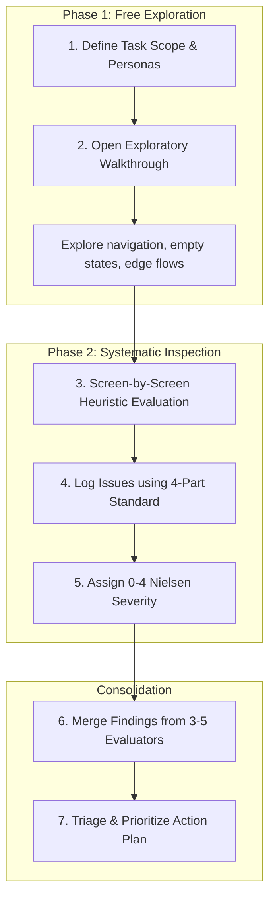

# 10 Usability Heuristics for User Interface Design

A canonical, industry-grade evaluation framework based on Jakob Nielsen and Rolf Molich's 10 Usability Heuristics (Nielsen Norman Group), expanded with modern UX audit workflows, psychological foundations (Jakob's Law, Slips vs. Mistakes, Natural Mapping), and adaptations for mobile (React Native/Expo/iOS/Android), web apps, AI, and video/spatial interfaces.

---

## Core Philosophy & Design Trade-offs

> **Heuristics are rules of thumb, not rigid laws.**
> They do not dictate exact UI specs; they provide a diagnostic lens to systematically identify cognitive friction, unclear mental models, and interaction flaws before conducting usability testing with real users.

### Balancing Heuristic Trade-offs
Heuristics sometimes pull in opposite directions. Applying them effectively requires deliberate design judgment:
- **Aesthetic Minimalism (H8) vs. Help & Documentation (H10):** Keep primary views clean by using progressive disclosure (contextual tooltips, expandable sheets) rather than overloading the main screen.
- **Error Prevention (H5) vs. Efficiency & Speed (H7):** Don't introduce high-friction confirmation dialogs for trivial/reversible actions; reserve confirmations only for irreversible, catastrophic operations.

---

## The 10 Usability Heuristics (NN/g Canonical Breakdown)

### 1. Visibility of System Status
> *The design should always keep users informed about what is going on, through appropriate feedback within a reasonable amount of time.*

- **Psychological Principle:** Predictable interactions build trust in the product and brand. Silence causes anxiety, repeated duplicate clicks, and abandonment.
- **Physical World Analogy:** *"You Are Here"* indicator pins on mall and airport directory maps.
- **Digital Benchmark Examples:**
  - **Uber:** Real-time driver vehicle location tracking on the map with live ETA updates.
  - **Google Drive:** Bottom-right percentage progress bar during file uploads, followed by a checkmark.
  - **Copy Action:** Floating temporary "Copied to clipboard" toast notification.
- **Checklist Questions:**
  - Is there immediate visual/haptic feedback on every tap, button press, and toggle?
  - Are background processes (API requests, file uploads, data sync) indicated with progress bars, skeletons, or spinners?
  - Does the UI disable submit buttons during active network requests to prevent double submission?
- **Do's & Don'ts:**
  - ✅ **DO:** Use deterministic progress bars for measurable uploads; skeleton screens for async data loads.
  - ❌ **DON'T:** Leave buttons active and clickable during in-flight mutations.

---

### 2. Match Between the System and the Real World
> *The design should speak the users' language. Use words, phrases, and concepts familiar to the user, rather than internal jargon. Follow real-world conventions, making information appear in a natural and logical order.*

- **Psychological Principle:** **Natural Mapping** — when controls physically and spatially correspond to their outcomes, the interface feels instantly intuitive.
- **Physical World Analogy:** **Stovetop Burner Knobs** — when the 4 control knobs are arranged in the same 2×2 layout as the burners, users immediately turn the correct knob without reading labels.
- **Digital Benchmark Examples:**
  - **E-Commerce:** "Shopping Cart" and "Checkout" instead of "Transaction Array" or "Purchase Queue".
  - **Apple Notes:** Legal-pad paper metaphor with familiar pencil/highlighter tools.
  - *Domain Caution:* In specialized enterprise/healthcare systems, using developer terms instead of domain-standard nomenclature can cause critical operational errors.
- **Checklist Questions:**
  - Are all labels, buttons, and error messages free from database column names or developer jargon?
  - Do icons map directly to physical counterparts (trash bin, folder, gear for settings)?
  - Is information ordered logically according to user mental models and local conventions?
- **Do's & Don'ts:**
  - ✅ **DO:** Use user-centric terms like "Save Draft", "Active Member", "Membership Plan".
  - ❌ **DON'T:** Expose raw database codes (e.g., `ERR_AUTH_500`, `is_actv_flg`, `NullPointer`).

---

### 3. User Control and Freedom
> *Users often perform actions by mistake. They need a clearly marked "emergency exit" to leave the unwanted action without having to go through an extended process.*

- **Psychological Principle:** Easy exits foster confidence and psychological safety, encouraging fearless exploration.
- **Physical World Analogy:** Clearly marked **Emergency Exit Doors** with push bars in public buildings.
- **Digital Benchmark Examples:**
  - **Gmail "Undo Send":** Provides a 5–30 second floating recall window after sending an email.
  - **Cancel & Dismiss:** Unsaved draft prompts, modal close buttons, and swipe-down sheets.
- **Checklist Questions:**
  - Is there an intuitive "Undo", "Cancel", or "Back" option on every multi-step flow and modal?
  - Can overlay sheets, dialogs, and drawers be dismissed easily (Esc key, background tap, swipe down)?
  - Can deleted items be restored from an archive or trash bin?
- **Do's & Don'ts:**
  - ✅ **DO:** Provide temporary undo toasts after destructive actions; support OS back gestures.
  - ❌ **DON'T:** Trap users in uncloseable full-screen modals without an exit button.

---

### 4. Consistency and Standards
> *Users should not have to wonder whether different words, situations, or actions mean the same thing. Follow platform and industry conventions.*

- **Psychological Principle:** **Jakob's Law** — *"Users spend most of their time on other digital products."* Their expectations are shaped by platform norms; breaking consistency increases cognitive load.
- **Physical World Analogy:** **Hotel Check-in Desks** — located immediately at the entrance lobby, meeting universal customer expectations.
- **Two Dimensions of Consistency:**
  1. **Internal Consistency:** Visual tokens, button hierarchies, and terminology remain identical across all screens within the product.
  2. **External Consistency:** Conforms to platform norms (Apple Human Interface Guidelines, Material Design 3) and universal web/mobile conventions.
- **Digital Benchmark Example:** Using "Delete" uniformly across an entire app rather than mixing "Delete", "Remove", "Trash", and "Erase" for the exact same action.
- **Checklist Questions:**
  - Are button variants (Primary, Secondary, Destructive) uniform across all views?
  - Are navigation elements located in standard, expected positions (top header, bottom tab bar)?
  - Does the app respect platform guidelines (iOS back swipe, Android system back)?
- **Do's & Don'ts:**
  - ✅ **DO:** Maintain a centralized design token system (spacing, colors, typography, border radius).
  - ❌ **DON'T:** Invent novel, non-standard UI controls for standard actions like date picking.

---

### 5. Error Prevention
> *Good error messages are important, but the best designs carefully prevent problems from occurring in the first place. Either eliminate error-prone conditions, or check for them and present users with a confirmation option before they commit to the action.*

- **Psychological Principle:** **Slips vs. Mistakes**:
  - **Slips:** Unconscious errors caused by inattention (e.g., typos, clicking the wrong row). *Prevented by constraints, smart defaults, input masks.*
  - **Mistakes:** Conscious errors based on a mismatch between the user's mental model and the design. *Prevented by clear explanations, double-confirmation dialogs, and reversibility.*
- **Physical World Analogy:** **Guard Rails on Mountain Roads** — physically prevents cars from veering off cliffs.
- **Digital Benchmark Examples:**
  - **Gmail Attachment Reminder:** Detects phrases like "I have attached" in email body and warns if no file was attached before sending.
  - **Airline Booking Sites:** Past departure dates and invalid return dates are greyed out and unselectable.
- **Checklist Questions:**
  - Are destructive actions protected by confirmation dialogs with clear warning labels?
  - Do forms apply input masks, character counters, and real-time constraints?
  - Are submission buttons disabled or intelligently validated until required fields are filled?
- **Do's & Don'ts:**
  - ✅ **DO:** Use date pickers and bounded dropdowns instead of freeform text fields.
  - ❌ **DON'T:** Allow submission of invalid forms only to reject them with a full page reload.

---

### 6. Recognition Rather than Recall
> *Minimize the user's memory load by making elements, actions, and options visible. The user should not have to remember information from one part of the interface to another. Information required to use the design should be visible or easily retrievable when needed.*

- **Cognitive Principle:** Human short-term working memory is strictly limited (~4–7 chunks). Recognition (e.g., multiple choice) requires significantly less cognitive energy than recall (e.g., remembering a code from memory).
- **Physical World Analogy:** Multiple-choice question: *"Is Lisbon the capital of Portugal?"* (Recognition) vs. *"What is the capital of Portugal?"* (Recall).
- **Digital Benchmark Examples:**
  - **Google Search & Amazon:** Dynamic autocomplete suggestions and "Recently Viewed Items" on homepages.
  - **Agoda / Booking.com:** Keeps selected travel dates and guest counts pinned at the top while browsing hotels.
- **Checklist Questions:**
  - Are recent searches, search filters, and suggested defaults visible?
  - Are password/input constraints visible inline while typing?
  - In multi-step wizards, is a summary of previous step selections visible?
- **Do's & Don'ts:**
  - ✅ **DO:** Provide visual breadcrumbs, dropdown search filters, and contextual tooltips.
  - ❌ **DON'T:** Require users to memorize IDs, codes, or previous values to complete a subsequent screen.

---

### 7. Flexibility and Efficiency of Use
> *Shortcuts — hidden from novice users — may speed up the interaction for the expert user so that the design can cater to both inexperienced and experienced users. Allow users to tailor frequent actions.*

- **Psychological Principle:** **Personalization & Customization**:
  - **Personalization:** System automatically tailors content and layout for individual usage patterns.
  - **Customization:** User explicitly configures settings, toolbars, shortcuts, and dashboard widgets.
- **Physical World Analogy:** **Navigation Routes** — tourists follow main signposted highways, while local drivers use familiar shortcut backstreets.
- **Digital Benchmark Example:** **Figma & Notion** — Novices use visible toolbars and menus; expert designers execute workflows at 5x speed using keyboard accelerators (`Cmd/Ctrl+K`, quick tool keys).
- **Checklist Questions:**
  - Are keyboard shortcuts or touch gestures available for high-frequency workflows?
  - Can power users customize views, save filter presets, or perform batch actions?
  - Are advanced configuration settings tucked behind progressive disclosure?
- **Do's & Don'ts:**
  - ✅ **DO:** Support command palettes (`Cmd+K`), swipe gestures, and batch operations.
  - ❌ **DON'T:** Force experienced users through repetitive, unskippable multi-step wizards every time.

---

### 8. Aesthetic and Minimalist Design
> *Interfaces should not contain information that is irrelevant or rarely needed. Every extra unit of information in an interface competes with the relevant units of information and diminishes their relative visibility.*

- **Psychological Principle:** Visual clutter increases cognitive friction and obscures primary user goals. *Note: Minimalism does not mandate flat design without visual affordances; it means removing non-essential visual noise.*
- **Physical World Analogy:** **Ornate Teapots** — an excessively decorative teapot with an awkward, heavy handle and narrow nozzle interferes with its primary usability function.
- **Digital Benchmark Examples:**
  - **Google Homepage:** Stripped down to a single logo and search bar — making the primary action unmistakable.
  - **Airbnb Search Cards:** Displays only essential decision criteria (photo, price, rating, title); detailed amenities and policies are one tap away.
- **Checklist Questions:**
  - Does each view feature one clear primary Call-to-Action (CTA)?
  - Is there adequate whitespace and clean padding preventing cognitive fatigue?
  - Are secondary details nested inside expandable accordions or detail views?
- **Do's & Don'ts:**
  - ✅ **DO:** Prioritize scannable visual hierarchy with bold headlines and clean card structures.
  - ❌ **DON'T:** Clutter screens with competing neon banners, redundant badges, and walls of dense text.

---

### 9. Help Users Recognize, Diagnose, and Recover from Errors
> *Error messages should be expressed in plain language (no error codes), precisely indicate the problem, and constructively suggest a solution.*

- **Psychological Principle:** When an error occurs, users are already stressed. Clear, constructive guidance transforms failure into immediate recovery.
- **Physical World Analogy:** **"Wrong Way" Road Signs** — bold, high-contrast signs alerting drivers heading into oncoming traffic and instructing them to turn around.
- **Digital Benchmark Examples:**
  - **Asana / Stripe:** Form validation highlights the exact field in red with an inline message: *"Password must be at least 8 characters with 1 number"* vs generic *"Error 400: Invalid payload"*.
  - **Friendly 404 Pages:** *"We can't find that page. The link might be broken or moved. Try searching or return home [Button]"*.
- **Checklist Questions:**
  - Does the error message clearly explain *what* happened without blaming the user?
  - Does it specify *how to fix it* with examples or direct recovery actions ("Retry", "Reset")?
  - Are errors placed directly adjacent to the relevant input field?
- **Do's & Don'ts:**
  - ✅ **DO:** Position error messages inline with clear visual cues and remedy suggestions.
  - ❌ **DON'T:** Show generic "Something went wrong" alerts without explaining what happened.

---

### 10. Help and Documentation
> *It’s best if the system doesn’t need any additional explanation. However, it may be necessary to provide documentation to help users understand how to complete their tasks. Help content should be easy to search, focused on the user's task, list concrete steps, and not be too large.*

- **Goal:** Deliver contextual, lightweight, task-oriented assistance exactly when and where needed.
- **Physical World Analogy:** **Airport Information Kiosks** — easily identifiable stations situated directly in traveler pathways offering immediate, task-focused directions.
- **Digital Benchmark Examples:**
  - **Stripe Dashboard:** Places contextual "?" info bubbles next to complex parameters (e.g., tax IDs, webhook signing secrets).
  - **Notion:** Structures help around user tasks (*"How do I invite team members?"*) rather than abstract feature specs (*"About Workspace Permissions"*).
- **Checklist Questions:**
  - Is help embedded contextually via tooltips and info icons next to complex options?
  - Is documentation searchable and organized by user tasks?
  - Are onboarding tooltips dismissible and non-intrusive?
- **Do's & Don'ts:**
  - ✅ **DO:** Provide task-oriented micro-guides and searchable FAQ modals.
  - ❌ **DON'T:** Force users to leave the app to read long, technical external manuals.

---

## The 2-Phase Heuristic Audit Protocol



### Step 1: Define Scope & User Goals
- Focus on high-intent workflows (e.g., *Member Registration*, *Locker Assignment*, *Checkout*).
- Ground evaluations in user personas and Job-to-be-Done (JTBD) statements.

### Step 2: Phase 1 — Free Exploratory Walkthrough
- Navigate the interface freely as a first-time user without evaluating rules yet.
- Test edge cases: cancel halfway, trigger empty states, simulate offline mode, submit empty forms.

### Step 3: Phase 2 — Systematic Heuristic Inspection
- Inspect every screen, modal, and state against the 10 heuristics.
- **Evaluators must work independently** to avoid groupthink and maximize coverage.

### Step 4: Log Issues Using the 4-Part Standard
Every reported usability issue must answer **What, When, Where, and How**:
> ❌ **Vague:** *"The member enrollment form is confusing."*
>
> ✅ **4-Part Standard:** *"During member enrollment (When), inconsistent button placement violates H4: Consistency (What). The 'Continue' button is right-aligned on Step 1 but left-aligned on Step 2 (Where), forcing visual hunting and slowing task completion (How/Why)."*

### Step 5: Assign Severity (0–4 Nielsen Scale)
- **0 - Not a problem:** Purely subjective preference.
- **1 - Cosmetic problem:** Minor styling inconsistency; fix if time permits.
- **2 - Minor usability issue:** Low priority; causes brief hesitation or minor confusion.
- **3 - Major usability issue:** High priority; causes repeated errors, user friction, or drop-offs.
- **4 - Usability catastrophe:** Critical blocker; prevents task completion or causes data loss.

### Step 6: Consolidate & Debrief (The 3-to-5 Evaluator Rule)
- A single evaluator catches only **~35%** of usability flaws.
- Aggregating independent reviews from **3 to 5 evaluators** boosts issue coverage to **75%–85%**.
- Debrief with the team: remove duplicate entries, average severity scores, and reconcile false alarms (~34% of flagged items may be non-critical in practice).

---

## Heuristic Evaluation vs. Usability Testing

| Dimension | Heuristic Evaluation | Usability Testing |
|---|---|---|
| **Speed** | ⚡ Fast (1–2 days / ~15 hours total) | ⏳ Moderate (1–2 weeks / ~45 hours total) |
| **Cost & Resources** | 💰 Low cost (internal team / UX designers) | 💵 Higher cost (participant recruiting, incentives) |
| **Primary Focus** | Rule & principle violations (inconsistency, missing feedback, jargon) | Real user behavioral friction (mental models, task stumbling, unpredicted workflows) |
| **When to Use** | Early prototypes, design reviews, pre-launch QA, competitor analysis | Validating refined prototypes or live features with target audience |

---

## Specialized Evaluation Tools

- **UX Check (Chrome Extension):** Lightweight in-browser audit tool for annotating live web interfaces and exporting findings.
- **Heurio:** Live collaborative feedback tool with built-in Nielsen severity tagging for product teams.
- **Miro / FigJam Templates:** Shared visual workspaces supporting independent evaluator swimlanes to prevent groupthink.

---

## Heuristic Audit Report Template

```markdown
# UX Heuristic Audit: [Feature / Flow Name]

## Executive Summary
- **Target Flow:** [e.g., Gym Member Enrollment Modal]
- **Evaluators Count:** [e.g., 3 Independent Evaluators]
- **Overall Usability Status:** [Pass / Needs Polish / Critical Fixes Required]
- **Issues Summary:** [X] Catastrophes, [Y] Major, [Z] Minor

## Detailed Findings

| # | Heuristic Violated | Location / Step | Issue Description (4-Part Standard) | Severity (0-4) | Recommended Fix |
|---|---|---|---|---|---|
| 1 | H1: Visibility of Status | Submit Button | On pressing 'Enroll', no loading spinner appears; button remains clickable causing duplicate entries | 4 (Catastrophe) | Add spinner state and disable button immediately on click |
| 2 | H5: Error Prevention | Locker Picker Sheet | Allows selecting occupied lockers without warning | 3 (Major) | Grey out and disable occupied locker chips with 'Occupied' badge |
| 3 | H4: Consistency (Internal) | Form Actions | 'Cancel' is a text link on Step 1 but a red button on Step 2 | 2 (Minor) | Standardize secondary button styling across all modal steps |
| 4 | H6: Recognition > Recall | Plan Selector | Plan duration and perks are not shown on selection chips | 2 (Minor) | Display monthly price and core perks directly on plan cards |

## Action Plan & Immediate Priorities
1. **[P0 - Blocker]** Add loading states and click-prevention to enrollment mutation.
2. **[P1 - High]** Disable occupied locker slots in locker assignment picker.
3. **[P2 - Medium]** Unify modal action button hierarchy across all steps.
```

---

## Modern Adaptations & Special Interfaces

### Mobile Apps (React Native / Expo / iOS / Android)
- **H1 (Status):** Integrate haptic feedback (`expo-haptics`) on pull-to-refresh, toggle switches, and form success.
- **H3 (Control):** Support swipe-to-dismiss bottom sheets, modal slide-downs, and hardware back button handling.
- **H4 (Standards):** Minimum touch target size of 44×44 pt (iOS) / 48×48 dp (Android); keep primary CTAs inside the ergonomic thumb zone.
- **H8 (Minimalism):** Respect small screen real estate — avoid cluttering mobile cards; tuck advanced options into sheets.

### AI & Conversational Interfaces
- **H1 (Status):** Stream response tokens in real-time with visual typing indicators.
- **H2 (Real World):** Explain AI recommendations in transparent, natural language.
- **H3 (Control):** Allow users to stop generation, edit previous prompts, regenerate, and rollback changes.
- **H5 (Error Prevention):** Clearly flag confidence boundaries and uncertainty for high-stakes AI outputs.

### Video Games & Virtual Reality (VR)
- **H1 (Status):** Heads-Up Display (HUD) feedback and spatial loading indicators.
- **H3 (Control):** Instant pause menus, checkpoint restores, and VR recentering emergency exits.
- **H8 (Minimalism):** Diegetic UI elements embedded directly into the 3D environment rather than screen-blocking menus.

---

## Alternative Cognitive & Usability Frameworks

### 1. Jill Gerhardt-Powals' Cognitive Engineering Principles (1996)
While Nielsen focuses on interaction friction, Gerhardt-Powals focuses on **human cognitive processing efficiency**:
1. **Automate unwanted workload:** Eliminate manual mental math, currency conversions, and date calculations (e.g., automatically compute age from DOB and days remaining from expiry date).
2. **Reduce uncertainty:** Display clear, unambiguous status tags rather than vague color dots.
3. **Fuse data:** Aggregate raw logs into high-level executive metrics (e.g., *"124 Enrolled • 8 On Floor Now • ৳14,500 Dues Pending"*).
4. **Present new information with meaningful aids:** Use familiar schemas, analogies, and metaphors.
5. **Use names conceptually related to function:** Align labels directly with user domain tasks.
6. **Group data in consistently meaningful ways:** Group athlete contact info, billing history, and locker keys into dedicated visual cards.
7. **Limit data-driven tasks:** Use visual progress bars and color-coded status chips to speed up data assimilation.
8. **Include only needed information:** Exclude irrelevant raw database fields to protect working memory.
9. **Provide multiple coding of data:** Combine **Color + Icon + Text Label** (e.g., 🔴 Red + 💳 Payment Icon + "৳1,200 Due") so accessibility is never reliant on color alone.
10. **Practice judicious redundancy:** Intentionally repeat critical indicators (e.g., due balance on card footer and inside billing tab) to balance consistency and task efficiency.

---

### 2. Susan Weinschenk & Dean Barker Classification (2000)
A comprehensive taxonomy synthesizing over 20 major usability guidelines:
- **Modal Integrity:** Match the input modality (touch gestures for mobile, keyboard accelerators for desktop).
- **Linguistic Clarity:** Clear, concise microcopy free from ambiguity.
- **Cultural Propriety & Domain Fit:** Respect regional business practices (e.g., bKash / Nagad payment methods, WhatsApp receipt sharing in Bangladesh).
- **Forgiveness:** Make actions non-destructive and easily recoverable.
- **Suitable Tempo:** Interactions match the pace of real-world front-desk operations.

---

### 3. Observer Trade-offs in Heuristic Auditing

| Audit Setup | How It Works | Pros | Cons / Trade-offs |
|---|---|---|---|
| **Without Observer (Solo Log)** | Evaluator walks through the app and writes a detailed log independently. | 💰 Low cost; zero scheduling overhead. | Takes longer for evaluator; higher interpretation effort during consolidation. |
| **With Observer (Think-Aloud)** | Evaluator vocalizes observations while an observer records and transcribes notes. | ⚡ Faster for evaluator; captures immediate cognitive reactions and nuances. | Requires 2 people per session; higher personnel cost. |

---

## 🚨 Jakob Nielsen’s Top Usability Anti-Patterns & Pitfalls to Avoid

When conducting usability evaluations or engineering UI workflows, beware of these classic, high-severity design failures (NN/g):

1. **Bad / Literal Search Engines:**
   - *Anti-Pattern:* Exact-match query engines that fail on minor typos, case mismatch, or partial phone numbers.
   - *Best Practice:* Provide forgiving, instant fuzzy search with clear match highlights and a 1-tap clear button (`×`).
2. **Walls of Non-Scannable Text:**
   - *Anti-Pattern:* Intimidating paragraph blobs that users refuse to read.
   - *Best Practice:* Structure content using subheadings, bullet points, bold key data tokens (`৳৩,৫০০`, `Locker #14`), and concise status pills.
3. **Hidden / Obscured Pricing & Status (Not Answering User Questions):**
   - *Anti-Pattern:* Hiding membership fees, obscuring renewal costs, or omitting due balances.
   - *Best Practice:* Transparent pricing cards, explicit payment breakdowns, and immediate status visibility (*Active, Expired, Suspended*).
4. **Banner Blindness & Ad-Like Visual Clutter:**
   - *Anti-Pattern:* Aggressive flashing badges, loud pseudo-banners, or intrusive popups that users close reflexively without reading.
   - *Best Practice:* Seamlessly integrate status alerts and prompts directly into the inline visual hierarchy.
5. **Breaking Native Back Navigation:**
   - *Anti-Pattern:* Trapping the user inside a modal or custom view by disabling hardware back button / iOS swipe-to-go-back.
   - *Best Practice:* Always provide an unambiguous close button, pull-down dismiss gesture, and support native back routing.
6. **Violating Core Platform Conventions:**
   - *Anti-Pattern:* Re-inventing standard navigation (e.g., hiding core tabs in an unexpected top dropdown).
   - *Best Practice:* Stick to established conventions so users' learned expectations from other apps seamlessly transfer.


