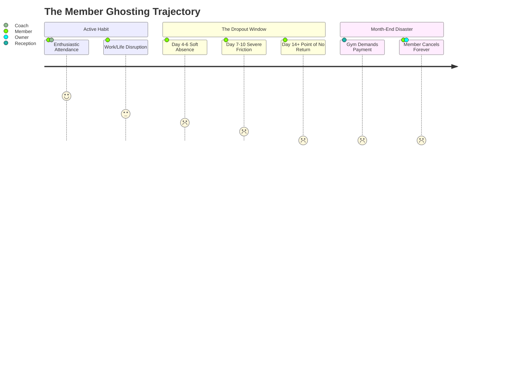

# 👻 GymOS: "Ghosting" Member Absentee Rescue Radar Specification
> **Document Code:** `GYM-SPEC-011-GHOSTING-MEMBER-ABSENTEE-RESCUE`  
> **Status:** `APPROVED FOR IMPLEMENTATION`  
> **Module:** Absenteeism Detection, Tier-based Ghosting Radar, 1-Tap Psychological WhatsApp Comeback Dispatcher, Reason Tagging & Anti-Spam Cool-down Protection  
> **Target Platforms:** iOS, Android, Web (Expo SDK 54 / React Native)

---

## 📑 Table of Contents
1. [Executive Summary & The Retention Crisis](#1-executive-summary--the-retention-crisis)
2. [The 4 Psychological Dropout Stages](#2-the-4-psychological-dropout-stages)
3. [Stakeholder Impact Matrix](#3-stakeholder-impact-matrix)
4. [The 5 Core Pillars of Absentee Rescue](#4-the-5-core-pillars-of-absentee-rescue)
5. [Technical Architecture & TypeScript Contracts](#5-technical-architecture--typescript-contracts)
6. [WhatsApp Psychological Comeback Copywriting Matrix](#6-whatsapp-psychological-comeback-copywriting-matrix)
7. [Edge Cases & Operational Guardrails](#7-edge-cases--operational-guardrails)

---

## 1. Executive Summary & The Retention Crisis

In Bangladesh fitness gyms (Dhaka, Chittagong, Sylhet), **over 45% of paying members drop out within their first 90 days**. 
The primary mechanism of member loss is **"Silent Ghosting"**:
- A member misses 5 to 7 consecutive days due to office deadlines, traffic fatigue, mild illness, or laziness.
- This creates mental friction: *"I've missed a week. It will hurt to go back. The coach will judge me. I'll just restart next month."*
- After 14 days without contact, the member crosses the **Point of No Return**. When the gym calls at month-end demanding subscription renewal, the member cancels outright.

**GymOS Absentee Rescue Radar** flips this dynamic by identifying missing members proactively on Day 4, 7, and 14, providing gym staff and trainers with a 1-tap psychological empathy message that cuts member churn by up to 50%.

---

## 2. The 4 Psychological Dropout Stages



| Absence Window | Psychological State | Member Thought | GymOS Rescue Strategy |
| :--- | :--- | :--- | :--- |
| **Days 1–3** | Normal Rest / Fluctuation | *"Just taking a couple of days off."* | No action. Do not annoy the member. |
| **Days 4–6 (Tier 1: Soft Alert)** | Habit Disruption | *"I should go back, but I'm getting lazy."* | Light check-in; workout buddy tone ("Missed leg day!"). |
| **Days 7–13 (Tier 2: Critical)** | Guilt & Resistance | *"It's been a week. Will be painful to restart."* | Empathy & friction-reduction ("Come for just 20 mins of light stretch & favorite chest set"). |
| **Days 14+ (Tier 3: Danger Zone)** | Churn Imminent | *"I practically quit. I won't pay next month."* | Comeback incentive ("Free Protein Shake + 7-Day pass extension"). |

---

## 3. Stakeholder Impact Matrix

| Persona | Before GymOS | After GymOS Absentee Radar |
| :--- | :--- | :--- |
| **Gym Owner** | Watches MRR plunge month after month with zero warning. | Real-time absentee radar tile on Command Hub showing live at-risk members. |
| **Floor Coach** | Has empty gym floors and loses client momentum. | 1-tap WhatsApp outreach to their assigned athletes directly from mobile. |
| **Reception / Manager** | Does awkward, confrontational debt collection calls at month-end. | Reaches out with care and hospitality during the active absence window. |
| **Member** | Feels neglected, embarrassed, and cancels subscription. | Feels remembered, cared for, and returns to the gym with zero guilt. |

---

## 4. The 5 Core Pillars of Absentee Rescue

1. **Live Command Hub Pulse Tile:**
   - Displays real-time badge: `[ 👻 Ghosting Radar | ⚠️ 14 Absent (7+ Days) ]`.
2. **Tier-Segmented Triage:**
   - Soft Alert (4–6 days), Critical (7–13 days), Danger (14+ days).
3. **Gender-Safe & Emotionally Intelligent Copywriting:**
   - Specific tailored templates for Male and Female athletes, preventing awkwardness or inappropriate language.
4. **Anti-Spam 3-Day Cool-Down Shield:**
   - Prevents duplicate outreach. Once a member is contacted, their status locks for 72 hours with a `[ ⏳ Contacted Today ]` badge.
5. **Absence Reason Tagging (Mute Protocol):**
   - Members who notify the front desk about exams, sickness, or travel can be tagged with `[ ✈️ Travel ]`, `[ 🩹 Sick ]`, or `[ 📚 Exams ]` to mute them from the radar.

---

## 5. Technical Architecture & TypeScript Contracts

### Data Contracts (`types/gym.ts`):

```typescript
export type GhostingTier = 'TIER_1_SOFT' | 'TIER_2_CRITICAL' | 'TIER_3_DANGER';
export type AbsenceReasonTag = 'NONE' | 'EXAMS' | 'TRAVEL' | 'SICK_INJURY' | 'PERSONAL_BUSY';

export interface GhostingMemberInfo {
  memberId: string;
  fullName: string;
  phone: string;
  gender: 'MALE' | 'FEMALE' | 'OTHER';
  assignedTrainerId?: string;
  assignedTrainerName?: string;
  membershipPlanTitle: string;
  daysAbsent: number;
  lastCheckInDate: string; // YYYY-MM-DD
  tier: GhostingTier;
  absenceReason: AbsenceReasonTag;
  lastRescueContactedDate?: string; // YYYY-MM-DD
  isCoolingDown: boolean;
}
```

### Store Methods (`stores/gym-owner-store.ts`):

```typescript
// Ghosting Radar Actions
getGhostingMembersSnapshot: () => {
  totalGhostingCount: number;
  criticalCount: number; // 7+ days
  dangerCount: number; // 14+ days
  members: GhostingMemberInfo[];
};
logMemberRescueContact: (memberId: string) => Promise<void>;
setMemberAbsenceReason: (memberId: string, reason: AbsenceReasonTag) => Promise<void>;
generateWhatsAppComebackMessage: (memberId: string) => string;
```

---

## 6. WhatsApp Psychological Comeback Copywriting Matrix

### Tier 1 (4–6 Days Absent — Male):
> "আসসালামু আলাইকুম {Name} ভাই! টানা {Days} দিন জিমে আপনাকে মিস করছি। শরীর ঠিক আছে তো? এই সপ্তাহে আপনার সাথে চেস্ট ওয়ার্কআউটটা মিস হয়ে গেল। আজ বিকেলে কি দেখা হচ্ছে? হালকা ২০ মিনিট ওয়ার্কআউট করব একসাথে! 💪 — Coach {Trainer}, {GymName}"

### Tier 2 (7–13 Days Absent — Male):
> "আসসালামু আলাইকুম {Name} ভাই! {GymName} থেকে কোচ {Trainer} বলছি। গত {Days} দিন যাবত আপনি আসেননি, আশা করি কোনো অসুস্থতা বা বড় ব্যস্ততা নেই। আপনি অনেক সুন্দর প্রগ্রেস করছিলেন, এই মোমেন্টামটা ধরে রাখুন। কোনো ব্যথা বা আলসেমি থাকলে আজ কোনো ভারী ওজন তুলতে হবে না—জাস্ট ২০ মিনিট আসুন, হালকা স্ট্রেচিং আর ফোম রোলিং করিয়ে দেব! দেখা হচ্ছে আজ? 🏋️‍♂️"

### Tier 1 / 2 (Female Athlete Template):
> "Dear {Name}, warm greetings from {GymName}! We noticed you have not been able to visit the gym for the past {Days} days. We hope you are doing wonderful. If work or schedule is busy, even a 20-minute light cardio or stretching session can refresh your energy. Female floor timings and trainers are ready for you. Let us know if you need any assistance! 🌸 — Team {GymName}"

---

## 7. Edge Cases & Operational Guardrails

1. **Frozen Members:** Members with an active freeze (`currentFreeze.status === 'ACTIVE'`) are strictly excluded from the ghosting radar.
2. **Expired Members:** Members whose membership has already expired belong in the **Renewal & Dues Radar**, not the Absentee Radar.
3. **Recent Contact Guard:** Once a contact is logged, the member enters a 3-day cool-down window to avoid spam complaints.
4. **False Positive Fallback:** Messages always include a polite disclaimer: *"If you have visited recently and check-in was missed, please let us know!"*
