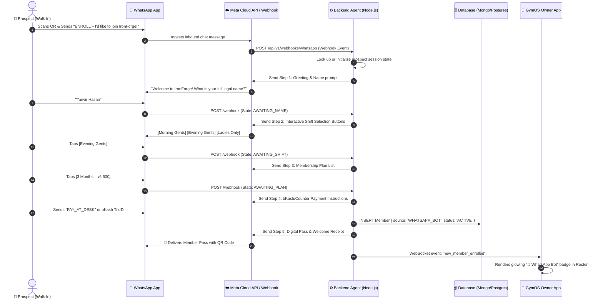
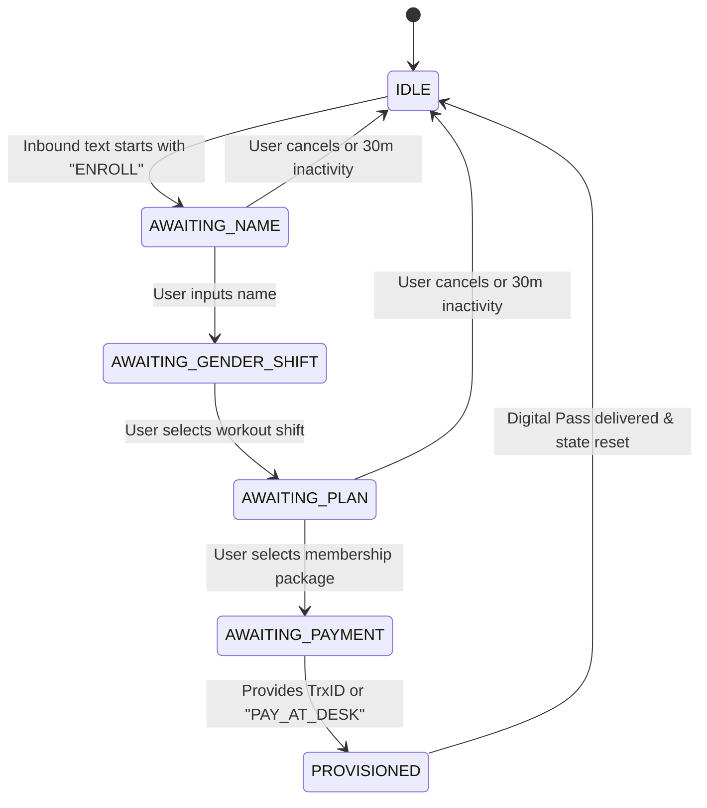

# 📲 GymOS: WhatsApp Self-Enroll Automation Agent Specification & Implementation Guide
> **Document Code:** `GYM-SPEC-016-WHATSAPP-SELF-ENROLL-AUTOMATION-AGENT`  
> **Status:** `READY FOR BACKEND IMPLEMENTATION`  
> **Module:** Contactless QR Scanning, Automated Conversational Onboarding Agent, Webhook Pipeline, Roster Provisioning & Digital Pass Delivery  
> **Target Systems:** Node.js / Express / NestJS Backend, Meta WhatsApp Cloud API (or Baileys Gateway), MongoDB / PostgreSQL, and React Native GymOS Client

---

## 📑 Table of Contents
1. [Executive Summary & Operational Impact](#1-executive-summary--operational-impact)
2. [End-to-End System Architecture](#2-end-to-end-system-architecture)
3. [Conversational Agent State Machine](#3-conversational-agent-state-machine)
4. [WhatsApp Interactive Message Templates & Copy](#4-whatsapp-interactive-message-templates--copy)
5. [Complete Backend Implementation Code](#5-complete-backend-implementation-code)
   - 5.1 [TypeScript Type Definitions](#51-typescript-type-definitions)
   - 5.2 [WhatsApp Cloud API Client (`whatsapp-api-client.ts`)](#52-whatsapp-cloud-api-client-whatsapp-api-clientts)
   - 5.3 [Conversational State Machine (`whatsapp-agent-engine.ts`)](#53-conversational-state-machine-whatsapp-agent-enginets)
   - 5.4 [Express Webhook Route Controller (`whatsapp-webhook-controller.ts`)](#54-express-webhook-route-controller-whatsapp-webhook-controllerts)
6. [Database Schema (Mongoose / Prisma)](#6-database-schema-mongoose--prisma)
7. [App-Store / Front-End Directory Synchronization](#7-app-store--front-end-directory-synchronization)
8. [Meta Cloud API Setup & Security Checklist](#8-meta-cloud-api-setup--security-checklist)

---

## 1. Executive Summary & Operational Impact

In Bangladesh fitness centers (Dhaka, Banani, Dhanmondi, Gulshan, Chittagong), **rush-hour bottlenecks occur between 6:00 PM and 9:00 PM**. 
Walk-in prospects standing at the counter either:
1. Wait 5–10 minutes while staff manually registers other members, leading to walkouts.
2. Experience paper-based registration errors (misspelled names, invalid phone numbers, unreadable handwriting).
3. Walk out without paying or leaving contact information for follow-up.

### The Solution: Contactless WhatsApp Self-Enrollment
When prospects scan the QR code on the counter display or from the Gym Owner app's **`[📲]`** button, their phone launches WhatsApp with a pre-configured deep link (`https://wa.me/8801805659610?text=ENROLL...`). 

The automated **WhatsApp Agent** handles the entire 60-second onboarding interview:
- Validates the athlete's full legal name and gender.
- Matches them to the correct schedule shift (Morning Gents, Evening Gents, Ladies Only).
- Presents active membership plans with transparent pricing.
- Provides bKash/Nagad merchant payment instructions or counter payment options.
- Automatically saves the member record into the Gym Roster with `enrollmentSource: 'WHATSAPP_BOT'`.
- Delivers an instant digital **Membership Pass & Receipt** directly into their WhatsApp chat.

---

## 2. End-to-End System Architecture



---

## 3. Conversational Agent State Machine



### State Definitions:
1. **`IDLE`**: No active enrollment in progress. Listens for keyword `ENROLL`.
2. **`AWAITING_NAME`**: Asks for athlete's legal name. Cleans and capitalizes string.
3. **`AWAITING_GENDER_SHIFT`**: Sends interactive buttons for shifts:
   - `Morning Gents Prime (06:00 - 10:00)`
   - `Evening Gents Rush (16:30 - 23:00)`
   - `Ladies Only Slot (10:00 - 16:30)`
4. **`AWAITING_PLAN`**: Presents active packages from database:
   - `1 Month Standard (৳2,500)`
   - `3 Months Beast (৳6,500)`
   - `1 Year Elite VIP (৳22,000 + Free Locker)`
5. **`AWAITING_PAYMENT`**: Prompts for bKash Merchant payment or Front-Desk settlement.
6. **`PROVISIONED`**: Creates member record, generates Member ID `#IF-XXXX`, and delivers digital pass.

---

## 4. WhatsApp Interactive Message Templates & Copy

### 4.1 Welcome Prompt (State: `AWAITING_NAME`)
```text
🏋️‍♂️ Welcome to *IronForge Fitness Arena*!
The premier strength & recovery facility in Banani.

Let's set up your athlete membership in less than 60 seconds! ⚡

👉 Please reply with your *Full Legal Name*:
```

### 4.2 Shift Selector (State: `AWAITING_GENDER_SHIFT`)
```json
{
  "type": "interactive",
  "interactive": {
    "type": "button",
    "header": { "type": "text", "text": "SELECT YOUR WORKOUT SCHEDULE" },
    "body": { "text": "Great to meet you, {{name}}! Which session time works best for your daily routine?" },
    "footer": { "text": "IronForge Fitness Operating System" },
    "action": {
      "buttons": [
        { "type": "reply", "reply": { "id": "SHIFT_MORN_GENTS", "title": "🌅 Morning Gents" } },
        { "type": "reply", "reply": { "id": "SHIFT_LADIES", "title": "🌸 Ladies Hours" } },
        { "type": "reply", "reply": { "id": "SHIFT_EVE_GENTS", "title": "🔥 Evening Gents" } }
      ]
    }
  }
}
```

### 4.3 Plan Selector (State: `AWAITING_PLAN`)
```json
{
  "type": "interactive",
  "interactive": {
    "type": "list",
    "header": { "type": "text", "text": "MEMBERSHIP PACKAGES" },
    "body": { "text": "Choose your training duration. All plans include full floor access & locker room amenities:" },
    "footer": { "text": "Tap button below to select plan" },
    "action": {
      "button": "View Membership Plans",
      "sections": [
        {
          "title": "Standard Durations",
          "rows": [
            { "id": "PLAN_1M", "title": "1 Month Admission", "description": "৳2,500/mo • Complete equipment access" },
            { "id": "PLAN_3M", "title": "3 Months (Most Popular)", "description": "৳6,500 (Save ৳1,000) • Includes workout chart" },
            { "id": "PLAN_1Y", "title": "1 Year VIP Membership", "description": "৳22,000 • Free Locker + 2 PT Sessions" }
          ]
        }
      ]
    }
  }
}
```

### 4.4 Payment Prompt (State: `AWAITING_PAYMENT`)
```text
🎯 *MEMBERSHIP SUMMARY — IRONFORGE FITNESS*
────────────────────────────
👤 *Athlete:* {{name}}
🕒 *Shift:* {{shiftName}}
📦 *Selected Plan:* {{planTitle}}
💰 *Total Amount:* ৳{{planPrice}}
────────────────────────────

💳 *PAYMENT OPTIONS:*
1️⃣ *bKash Merchant Pay:*
   • Dial *247# ➔ Make Payment
   • Merchant Number: *01805659610*
   • Reference: *{{cleanFirstName}}*
   • Counter: *1*

2️⃣ *Pay at Front-Desk:*
   • Pay cash or card when you walk in for your first workout!

👉 *Reply with your 10-character bKash Transaction ID, or type "PAY_AT_DESK" to complete registration now.*
```

### 4.5 Completion & Digital Pass (State: `PROVISIONED`)
```text
🎉 *CONGRATULATIONS & WELCOME TO THE FAMILY!* 🥊
────────────────────────────
Your membership is officially active in our system!

🆔 *Member ID:* #{{memberId}}
📅 *Start Date:* {{startDate}}
🏁 *Expiry Date:* {{endDate}}
📍 *Location:* Level 4, Road 11, Block D, Banani, Dhaka

📱 *HOW TO CHECK IN AT THE FRONT DESK:*
Simply tell the receptionist your phone number (*{{phone}}*) or quote your ID *#{{memberId}}*.

See you on the iron floor! 💪
_IronForge Fitness OS — Powered by Vital_
```

---

## 5. Complete Backend Implementation Code

The following code is production-ready TypeScript for your Node.js backend.

### 5.1 TypeScript Type Definitions (`types/whatsapp-bot.ts`)

```typescript
export type BotSessionStep =
  | 'IDLE'
  | 'AWAITING_NAME'
  | 'AWAITING_SHIFT'
  | 'AWAITING_PLAN'
  | 'AWAITING_PAYMENT'
  | 'COMPLETED';

export interface BotUserSession {
  phone: string; // e.g., '8801805659610'
  step: BotSessionStep;
  fullName?: string;
  gender?: 'MALE' | 'FEMALE';
  shiftId?: string;
  shiftName?: string;
  planId?: string;
  planTitle?: string;
  planPriceBdt?: number;
  planDurationMonths?: number;
  paymentMethod?: 'bKash' | 'Counter_Cash' | 'Nagad';
  paymentReference?: string;
  createdAt: number;
  lastUpdatedAt: number;
}
```

---

### 5.2 WhatsApp Cloud API Client (`services/whatsapp-api-client.ts`)

```typescript
import axios from 'axios';

const META_GRAPH_URL = 'https://graph.facebook.com/v21.0';
const PHONE_NUMBER_ID = process.env.META_WA_PHONE_NUMBER_ID || '';
const ACCESS_TOKEN = process.env.META_WA_ACCESS_TOKEN || '';

export class WhatsAppApiClient {
  /**
   * Sends a simple text message.
   */
  static async sendTextMessage(to: string, text: string): Promise<void> {
    const url = `${META_GRAPH_URL}/${PHONE_NUMBER_ID}/messages`;
    await axios.post(
      url,
      {
        messaging_product: 'whatsapp',
        recipient_type: 'individual',
        to: to.replace(/[^0-9]/g, ''),
        type: 'text',
        text: { body: text },
      },
      {
        headers: {
          Authorization: `Bearer ${ACCESS_TOKEN}`,
          'Content-Type': 'application/json',
        },
      }
    );
  }

  /**
   * Sends 1 to 3 quick-reply interactive buttons.
   */
  static async sendQuickReplyButtons(
    to: string,
    bodyText: string,
    buttons: { id: string; title: string }[]
  ): Promise<void> {
    const url = `${META_GRAPH_URL}/${PHONE_NUMBER_ID}/messages`;
    await axios.post(
      url,
      {
        messaging_product: 'whatsapp',
        recipient_type: 'individual',
        to: to.replace(/[^0-9]/g, ''),
        type: 'interactive',
        interactive: {
          type: 'button',
          body: { text: bodyText },
          action: {
            buttons: buttons.map((b) => ({
              type: 'reply',
              reply: { id: b.id, title: b.title.slice(0, 20) },
            })),
          },
        },
      },
      {
        headers: {
          Authorization: `Bearer ${ACCESS_TOKEN}`,
          'Content-Type': 'application/json',
        },
      }
    );
  }

  /**
   * Sends an interactive list message.
   */
  static async sendListMessage(
    to: string,
    bodyText: string,
    buttonTitle: string,
    sections: { title: string; rows: { id: string; title: string; description?: string }[] }[]
  ): Promise<void> {
    const url = `${META_GRAPH_URL}/${PHONE_NUMBER_ID}/messages`;
    await axios.post(
      url,
      {
        messaging_product: 'whatsapp',
        recipient_type: 'individual',
        to: to.replace(/[^0-9]/g, ''),
        type: 'interactive',
        interactive: {
          type: 'list',
          body: { text: bodyText },
          action: {
            button: buttonTitle.slice(0, 20),
            sections,
          },
        },
      },
      {
        headers: {
          Authorization: `Bearer ${ACCESS_TOKEN}`,
          'Content-Type': 'application/json',
        },
      }
    );
  }
}
```

---

### 5.3 Conversational State Machine (`services/whatsapp-agent-engine.ts`)

```typescript
import { BotUserSession } from '../types/whatsapp-bot';
import { WhatsAppApiClient } from './whatsapp-api-client';
import { MemberModel } from '../models/gym-member.model'; // Your Mongoose or Prisma model

// In-memory session cache (or Redis in multi-instance cluster)
const SESSIONS: Map<string, BotUserSession> = new Map();
const SESSION_TTL_MS = 30 * 60 * 1000; // 30 mins

export class WhatsAppAgentEngine {
  private static getOrCreateSession(phone: string): BotUserSession {
    const now = Date.now();
    const existing = SESSIONS.get(phone);
    if (existing && now - existing.lastUpdatedAt < SESSION_TTL_MS) {
      return existing;
    }
    const fresh: BotUserSession = {
      phone,
      step: 'IDLE',
      createdAt: now,
      lastUpdatedAt: now,
    };
    SESSIONS.set(phone, fresh);
    return fresh;
  }

  public static async handleInboundMessage(
    senderPhone: string,
    messageType: 'text' | 'interactive',
    payload: { text?: string; buttonId?: string; listRowId?: string }
  ): Promise<void> {
    const session = this.getOrCreateSession(senderPhone);
    session.lastUpdatedAt = Date.now();

    const textContent = (payload.text || '').trim();
    const actionId = payload.buttonId || payload.listRowId || '';

    // Global reset trigger
    if (textContent.toUpperCase() === 'RESET' || textContent.toUpperCase() === 'CANCEL') {
      session.step = 'IDLE';
      await WhatsAppApiClient.sendTextMessage(
        senderPhone,
        'Registration session cancelled. Type *ENROLL* anytime to restart! 💪'
      );
      return;
    }

    switch (session.step) {
      case 'IDLE': {
        if (textContent.toUpperCase().includes('ENROLL')) {
          session.step = 'AWAITING_NAME';
          await WhatsAppApiClient.sendTextMessage(
            senderPhone,
            `🏋️‍♂️ *Welcome to IronForge Fitness Arena!*\n\nLet's get your membership registered in 60 seconds! ⚡\n\n👉 Please reply with your *Full Legal Name*:`
          );
        }
        break;
      }

      case 'AWAITING_NAME': {
        if (textContent.length < 3) {
          await WhatsAppApiClient.sendTextMessage(
            senderPhone,
            'Please enter a valid full name (at least 3 letters):'
          );
          return;
        }
        session.fullName = textContent;
        session.step = 'AWAITING_SHIFT';

        await WhatsAppApiClient.sendQuickReplyButtons(
          senderPhone,
          `Great to meet you, *${session.fullName}*! Which workout schedule fits your daily routine?`,
          [
            { id: 'SHIFT_MORN_GENTS', title: 'Morning Gents' },
            { id: 'SHIFT_LADIES', title: 'Ladies Shift' },
            { id: 'SHIFT_EVE_GENTS', title: 'Evening Gents' },
          ]
        );
        break;
      }

      case 'AWAITING_SHIFT': {
        const shiftMap: Record<string, { name: string; gender: 'MALE' | 'FEMALE' }> = {
          SHIFT_MORN_GENTS: { name: 'Morning Gents Prime (06:00 - 10:00)', gender: 'MALE' },
          SHIFT_LADIES: { name: 'Ladies Only Hours (10:00 - 16:30)', gender: 'FEMALE' },
          SHIFT_EVE_GENTS: { name: 'Evening Gents Rush (16:30 - 23:00)', gender: 'MALE' },
        };

        const chosen = shiftMap[actionId] || shiftMap['SHIFT_EVE_GENTS'];
        session.shiftId = actionId;
        session.shiftName = chosen.name;
        session.gender = chosen.gender;
        session.step = 'AWAITING_PLAN';

        await WhatsAppApiClient.sendListMessage(
          senderPhone,
          `Selected Shift: *${chosen.name}*\n\nPlease select your preferred membership duration below:`,
          'View Gym Packages',
          [
            {
              title: 'Available Packages',
              rows: [
                { id: 'PLAN_1M', title: '1 Month Standard', description: '৳2,500/mo • Open floor access' },
                { id: 'PLAN_3M', title: '3 Months (Save ৳1,000)', description: '৳6,500 • Includes diet outline' },
                { id: 'PLAN_1Y', title: '1 Year VIP Elite', description: '৳22,000 • Locker + 2 PT sessions' },
              ],
            },
          ]
        );
        break;
      }

      case 'AWAITING_PLAN': {
        const planMap: Record<string, { title: string; price: number; months: number }> = {
          PLAN_1M: { title: '1 Month Standard', price: 2500, months: 1 },
          PLAN_3M: { title: '3 Months Value', price: 6500, months: 3 },
          PLAN_1Y: { title: '1 Year VIP Elite', price: 22000, months: 12 },
        };

        const plan = planMap[actionId] || planMap['PLAN_1M'];
        session.planId = actionId;
        session.planTitle = plan.title;
        session.planPriceBdt = plan.price;
        session.planDurationMonths = plan.months;
        session.step = 'AWAITING_PAYMENT';

        const summary =
          `🎯 *REGISTRATION SUMMARY*\n` +
          `────────────────────────\n` +
          `👤 *Athlete:* ${session.fullName}\n` +
          `🕒 *Schedule:* ${session.shiftName}\n` +
          `📦 *Package:* ${plan.title}\n` +
          `💰 *Total Amount:* ৳${plan.price.toLocaleString()}\n` +
          `────────────────────────\n\n` +
          `💳 *HOW TO COMPLETE PAYMENT:*\n` +
          `1️⃣ *bKash Merchant Payment:*\n` +
          `   • Dial *247# ➔ Make Payment\n` +
          `   • Merchant Number: *01805659610*\n` +
          `   • Reference: *${session.fullName?.split(' ')[0]}*\n\n` +
          `2️⃣ *Pay at Reception Desk:*\n` +
          `   • Pay cash or card when you arrive for your first workout!\n\n` +
          `👉 *Reply with your 10-digit bKash TrxID or type "PAY_AT_DESK" to activate your pass:*`;

        await WhatsAppApiClient.sendTextMessage(senderPhone, summary);
        break;
      }

      case 'AWAITING_PAYMENT': {
        const isDesk = textContent.toUpperCase().includes('DESK') || textContent.toUpperCase().includes('CASH');
        const paymentMethod = isDesk ? 'Counter_Cash' : 'bKash';
        const reference = isDesk ? 'DESK_SETTLEMENT' : textContent;

        // Generate Dates
        const startDate = new Date().toISOString().split('T')[0];
        const endDateObj = new Date();
        endDateObj.setMonth(endDateObj.getMonth() + (session.planDurationMonths || 1));
        const endDate = endDateObj.toISOString().split('T')[0];

        const generatedMemberId = `IF-${Math.floor(1000 + Math.random() * 9000)}`;

        // Save member in Database
        await MemberModel.create({
          id: `mem_${Date.now()}`,
          memberIdCode: generatedMemberId,
          fullName: session.fullName,
          phone: senderPhone.startsWith('+') ? senderPhone : `+${senderPhone}`,
          gender: session.gender || 'MALE',
          packageTitle: session.planTitle,
          status: 'ACTIVE',
          startDate,
          endDate,
          paidAmountBdt: isDesk ? 0 : session.planPriceBdt,
          dueAmountBdt: isDesk ? session.planPriceBdt : 0,
          paymentMethod,
          paymentReference: reference,
          enrollmentSource: 'WHATSAPP_BOT',
          whatsappEnrolledAt: new Date().toISOString(),
        });

        // Send Final Digital Pass to WhatsApp
        const welcomeMessage =
          `🎉 *CONGRATULATIONS & WELCOME TO IRONFORGE!* 🥊\n\n` +
          `Your membership profile is now officially provisioned:\n\n` +
          `🆔 *Member ID:* #${generatedMemberId}\n` +
          `📅 *Start Date:* ${startDate}\n` +
          `🏁 *Expiry Date:* ${endDate}\n` +
          `💵 *Fee Status:* ${isDesk ? `৳${session.planPriceBdt} (Due at desk)` : 'PAID IN FULL ✅'}\n\n` +
          `📱 *CHECK-IN INSTRUCTION:*\n` +
          `When you arrive at Level 4, Banani, simply state your phone number or quote ID *#${generatedMemberId}* at the front desk terminal.\n\n` +
          `See you on the floor! Keep crushing it! 💪`;

        await WhatsAppApiClient.sendTextMessage(senderPhone, welcomeMessage);

        // Reset session
        SESSIONS.delete(senderPhone);
        break;
      }
    }
  }
}
```

---

### 5.4 Express Webhook Route Controller (`controllers/whatsapp-webhook.ts`)

```typescript
import { Request, Response, Router } from 'express';
import { WhatsAppAgentEngine } from '../services/whatsapp-agent-engine';

const router = Router();
const VERIFY_TOKEN = process.env.META_WA_VERIFY_TOKEN || 'ironforge_secure_webhook_verify_2026';

/**
 * 1. GET /webhook — Webhook Verification endpoint required by Meta Developer Portal.
 */
router.get('/webhook', (req: Request, res: Response) => {
  const mode = req.query['hub.mode'];
  const token = req.query['hub.verify_token'];
  const challenge = req.query['hub.challenge'];

  if (mode === 'subscribe' && token === VERIFY_TOKEN) {
    console.log('✅ Meta WhatsApp Webhook Verified successfully');
    return res.status(200).send(challenge);
  }
  return res.sendStatus(403);
});

/**
 * 2. POST /webhook — Receives incoming customer messages from Meta.
 */
router.post('/webhook', async (req: Request, res: Response) => {
  try {
    const body = req.body;

    if (body.object === 'whatsapp_business_account') {
      for (const entry of body.entry || []) {
        for (const change of entry.changes || []) {
          const value = change.value;
          if (value?.messages && value.messages.length > 0) {
            const message = value.messages[0];
            const senderPhone = message.from; // e.g. "8801805659610"

            if (message.type === 'text') {
              await WhatsAppAgentEngine.handleInboundMessage(senderPhone, 'text', {
                text: message.text.body,
              });
            } else if (message.type === 'interactive') {
              const interactive = message.interactive;
              if (interactive.type === 'button_reply') {
                await WhatsAppAgentEngine.handleInboundMessage(senderPhone, 'interactive', {
                  buttonId: interactive.button_reply.id,
                  text: interactive.button_reply.title,
                });
              } else if (interactive.type === 'list_reply') {
                await WhatsAppAgentEngine.handleInboundMessage(senderPhone, 'interactive', {
                  listRowId: interactive.list_reply.id,
                  text: interactive.list_reply.title,
                });
              }
            }
          }
        }
      }
    }
    // Meta requires immediate 200 OK acknowledgment
    return res.sendStatus(200);
  } catch (error) {
    console.error('❌ Error handling WhatsApp Webhook:', error);
    return res.sendStatus(200); // Always return 200 to Meta to prevent retry storm
  }
});

export default router;
```

---

## 6. Database Schema (Mongoose / MongoDB Example)

```typescript
import { Schema, model } from 'mongoose';

const GymMemberSchema = new Schema(
  {
    id: { type: String, required: true, unique: true },
    memberIdCode: { type: String, required: true, unique: true }, // e.g. IF-1042
    fullName: { type: String, required: true },
    phone: { type: String, required: true, index: true },
    gender: { type: String, enum: ['MALE', 'FEMALE', 'OTHER'], default: 'MALE' },
    status: {
      type: String,
      enum: ['ACTIVE', 'EXPIRING_SOON', 'EXPIRED', 'FROZEN', 'UNPAID'],
      default: 'ACTIVE',
    },
    packageTitle: { type: String, required: true },
    startDate: { type: String, required: true }, // YYYY-MM-DD
    endDate: { type: String, required: true },   // YYYY-MM-DD
    paidAmountBdt: { type: Number, default: 0 },
    dueAmountBdt: { type: Number, default: 0 },
    paymentMethod: { type: String, default: 'bKash' },
    paymentReference: { type: String },
    enrollmentSource: {
      type: String,
      enum: ['MANUAL', 'WHATSAPP_BOT', 'QR_SELF_ENROLL'],
      default: 'WHATSAPP_BOT',
    },
    whatsappEnrolledAt: { type: String },
    emergencyContact: { type: String },
    lockerNumber: { type: String },
  },
  { timestamps: true }
);

export const MemberModel = model('GymMember', GymMemberSchema);
```

---

## 7. Front-End Directory Synchronization

When a member registers via the WhatsApp Bot:
1. **Source Tagging:** The record has `enrollmentSource: 'WHATSAPP_BOT'` and `whatsappEnrolledAt: ISO_STRING`.
2. **Member Screen UI:** In [gym-member-directory-screen-view.tsx](file:///c:/Users/Khaled/Khaled%20Dask/app/fitnes-my-app/components/gym-owner/gym-member-directory-screen-view.tsx), lines 409–418 automatically show:
   ```tsx
   {member.enrollmentSource === 'WHATSAPP_BOT' && (
     <View style={styles.waSourceBadge}>
       <Text style={styles.waSourceBadgeText}>📲 WhatsApp Bot</Text>
     </View>
   )}
   ```
3. **Check-In Station:** The athlete can check in at the counter using their phone number or Member ID within 5 seconds of registration.

---

## 8. Meta Cloud API Setup & Security Checklist

When you are ready to configure the backend:

1. **Meta Developer Portal:**
   - Go to [developers.facebook.com](https://developers.facebook.com) ➔ Create App ➔ Select **Business**.
   - Add **WhatsApp Product**.
2. **Add Your Phone Number (`01805659610`):**
   - Add the phone number under WhatsApp ➔ API Setup.
   - Verify ownership via SMS OTP.
3. **Configure Webhook URL:**
   - Callback URL: `https://your-domain.com/api/v1/webhooks/whatsapp`
   - Verify Token: `ironforge_secure_webhook_verify_2026`
   - Webhook Fields Subscription: Check `messages`.
4. **Permanent System User Token:**
   - Under Business Settings ➔ System Users ➔ Generate Token with permissions `whatsapp_business_messaging` and `whatsapp_business_management`.
5. **Environment Variables for Backend (`.env`):**
   ```env
   META_WA_PHONE_NUMBER_ID=your_meta_phone_number_id
   META_WA_ACCESS_TOKEN=your_system_user_permanent_token
   META_WA_VERIFY_TOKEN=ironforge_secure_webhook_verify_2026
   ```

---
*Documentation prepared for GymOS Bangladesh Operations • Fitness App SDK 57*
