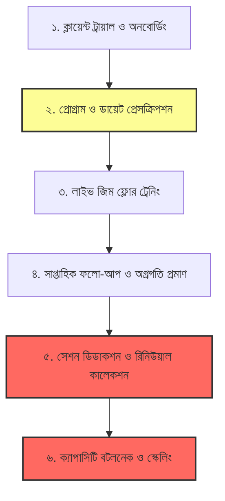

# 🏋️‍♂️ Vital Fitness — Gym Coach Real-World Pain Points Discovery & Validation Audit

> **Document Status:** Comprehensive Product Discovery & Reality-Check Audit  
> **Role Context:** Senior Product Researcher, Gym Operations Consultant, Personal Training Business Analyst & B2B SaaS Product Strategist  
> **Target Audience:** Personal Trainers (PTs), Floor Coaches, Independent Trainers, Hybrid Online/Offline Coaches, Small Gym Owners in Bangladesh & Emerging Markets  
> **Core Objective:** Separate genuine, high-friction, monetizable operational pain points from superficial inconveniences and feature-seeking assumptions.

---

## 🏆 ১. এক্সিকিউটিভ সামারি ও অডিট রায় (Executive Verdict)

আমাদের আগের ৬টি অনুমানকৃত সমস্যা (Assumed Pain Points) নিয়ে গভীর বাস্তবমুখী যাচাই-বাছাই ও অডিটের চূড়ান্ত সিদ্ধান্ত:

```
┌────────────────────────────────────────────────────────────────────────────────────────┐
│                               HYPOTHESIS AUDIT VERDICT                                 │
├────┬──────────────────────────────────────────┬─────────────────────────────┬──────────┤
│ #  │ Pain Point Hypothesis                    │ Reality-Check Verdict       │ Priority │
├────┼──────────────────────────────────────────┼─────────────────────────────┼──────────┤
│ 1  │ WhatsApp + Notebook Chaos                │ 🟡 PARTIALLY VALIDATED      │ High     │
│ 2  │ Diet Adherence Black Hole ("Lying")      │ 🔴 WEAK / BEHAVIORAL RISK   │ Low/Drop │
│ 3  │ Session Counting & Renewal Awkwardness   │ 🟢 FULLY VALIDATED          │ CRITICAL │
│ 4  │ Injury History & Safety Liability        │ ⚪ REJECTED AS CORE SAAS    │ Baseline │
│ 5  │ Scalability Bottleneck & Trainer Burnout │ 🟢 FULLY VALIDATED          │ CRITICAL │
│ 6  │ Foreign Food Database / Local Desi Diet  │ 🟡 PARTIALLY VALIDATED (MD) │ High     │
└────┴──────────────────────────────────────────┴─────────────────────────────┴──────────┘
```

### 🔍 মূল পর্যবেক্ষণ (Key Takeaways):

1. **সেশন হিসাব ও রিনিউয়াল রিমাইন্ডার (Hypothesis 3):** ট্রেইনারদের সরাসরি ১০-২০% ইনকাম লস হয় সেশন কাউন্টিংয়ের গরমিল এবং টাকা চাওয়ার সামাজিক দ্বিধার কারণে। এটি **এক নম্বর মোনেটাইজেবল পেইন পয়েন্ট**।
2. **স্কেলেবিলিটি সিলিং ও রুটিন বানানোর সময় নষ্ট (Hypothesis 5):** ১৫-২০ জন ক্লায়েন্টের পর ট্রেইনারদের শারীরিক ও মানসিক বার্নআউট আসে। নতুন ক্লায়েন্টের জন্য বারবার স্ক্র্যাচ থেকে রুটিন তৈরি করা সময় অপচয়ের প্রধান কারণ।
3. **WhatsApp বিশৃঙ্খলা (Hypothesis 1):** হোয়াটসঅ্যাপ যোগাযোগের জন্য সেরা, কিন্তু **হিস্ট্রি খোঁজা ও ট্র্যাকিংয়ের জন্য অচল**। হোয়াটসঅ্যাপ প্রতিস্থাপন করা যাবে না, বরং **হোয়াটসঅ্যাপে ১-ট্যাপে শেয়ার করার মতো টুল** বানাতে হবে।
4. **দেশি খাবারের পুষ্টি অনুমান (Hypothesis 6):** সমস্যাটি ডাটাবেজে খাবারের নাম না থাকা নয়; সমস্যা হলো **আমাদের বাড়ির রান্না করা এক হাঁড়ির তেল-মসলাযুক্ত মিশ্র খাবারের ওজন মাপা অসম্ভব**। সমাধান হলো "ভিজ্যুয়াল প্লেট রুলস" ও "পোর্শন এস্টিমেশন"।
5. **ডায়েট ট্র্যাকিং ও ক্লায়েন্টের মিথ্যা বলা (Hypothesis 2):** ক্লায়েন্ট ইচ্ছে করে মিথ্যা বলে না, গ্রাম ধরে কাঁচা খাবার মাপা বাস্তবসম্মত নয়। ট্রেইনারকে ক্লায়েন্টের প্রতিদিনের খাবারের গোয়েন্দাগিরি করতে বাধ্য করা ট্রেইনারের কাজের বোঝা বাড়িয়ে দেয়।
6. **ইনজুরি হিস্ট্রি ভুলে যাওয়া (Hypothesis 4):** ট্রেইনাররা জিম ফ্লোরে সরাসরি ক্লায়েন্টের সাথে কথা বলে এক্সারসাইজ বদলে দেন। শুধু ইনজুরি সতর্কতার জন্য কেউ আলাদা সফটওয়্যার কিনবে না।

---

## 🏋️ ২. রিয়েল কোচ ওয়ার্কফ্লো ম্যাপিং (Real-World Coach Lifecycle)



### বিস্তারিত কাজের ধাপ ও তথ্যের লিকেজ:

1. **Onboarding & Screening:** কাগজের ফর্মে বা হোয়াটসঅ্যাপে তথ্য নেওয়া হয়। মেডিকেল নোট ও প্রাথমিক ছবি ফোনের গ্যালারিতে ব্যক্তিগত ছবির ভিড়ে হারিয়ে যায়।
2. **Program Creation:** প্রতিবার নতুন ক্লায়েন্টের জন্য ওয়ার্ড ফাইল বা হোয়াটসঅ্যাপ টেক্সটে ৩০-৬০ মিনিট ব্যয় করে রুটিন তৈরি। কোনো রি-ইউজেবল মডুলার টেমপ্লেট লাইব্রেরি থাকে না।
3. **Floor Execution:** লাইভ ট্রেনিংয়ের সময় ট্রেইনার স্পটিং ও ফর্ম চেক করাতে ব্যস্ত থাকেন। ওই মুহূর্তে মোবাইল অ্যাপে গিয়ে সেট/রেপ লগ করা অসম্ভব ও অপেশাদার দেখায়।
4. **Progression & Proof:** বাথরুমের স্কেলে ওজন না কমলে ক্লায়েন্ট ডিমোটিভেটেড হয়ে জিম ছেড়ে দেয়। কোচের কাছে তাৎক্ষণিক সাইড-বাই-সাইড ফটো তুলনা বা প্রোগ্রেসিভ ওভারলোড গ্রাফ দেখানোর টুল থাকে না।
5. **Package Admin & Billing:** ১২/২৪ সেশনের হিসাব ট্রেইনার খাতায় লেখেন, ক্লায়েন্ট মনে রাখে না। প্যাকেজ শেষ হলে মুখে টাকা চাইতে বিব্রত বোধ করেন।
6. **Scaling Barrier:** সকাল ৬টা-১১টা এবং বিকাল ৪টা-৯টা ফ্লোরে কাজ করার পর ট্রেইনারের কোনো এনার্জি থাকে না রিমোট বা অনলাইন ক্লায়েন্ট নেওয়ার।

---

## 🔥 ৩. প্রাথমিক ৬টি হাইপোথিসিসের চুলচেরা অডিট (In-Depth Hypothesis Audit)

### হাইপোথিসিস ১: "WhatsApp + Notebook Chaos"

- **স্ট্যাটাস:** `PARTIALLY VALIDATED`
- **বাস্তব চিত্র:** সাধারণ চ্যাটের জন্য হোয়াটসঅ্যাপ সেরা। সমস্যা বাঁধে যখন ১০ জনের বেশি ক্লায়েন্ট হয় এবং ট্রেইনারকে খুঁজতে হয়: _"গত মাসে তানভীরের স্কোয়াট কত ছিল?"_ বা _"রাকিব ভাইয়ের ডায়েট প্ল্যান কোথায় গেল?"_।
- **সঠিক প্রোডাক্ট সমাধান:** হোয়াটসঅ্যাপ রিপ্লেস করার চেষ্টা না করে এমন ড্যাশবোর্ড দেওয়া যা থেকে **১-ক্লিকে সুন্দর কার্ড/পিডিএফ আকারে হোয়াটসঅ্যাপে পাঠানো যায়**।

### হাইপোথিসিস ২: "Diet Adherence Black Hole"

- **স্ট্যাটাস:** `WEAK / HIGH BEHAVIORAL RISK`
- **বাস্তব চিত্র:** ক্লায়েন্টকে গ্রাম ধরে প্রতি বেলার কাঁচা খাবার ও তেলের হিসাব লিখতে বলা অবাস্তব। এতে ক্লায়েন্ট ১ সপ্তাহ পর লগ করা বন্ধ করে দেয়। ট্রেইনার রাতে বসে ৫০ জনের ফুড ডায়েরি চেক করার অবৈতনিক বাড়তি কাজ করতে চান না।
- **সঠিক প্রোডাক্ট সমাধান:** গ্রাম-ভিত্তিক ট্র্যাকিংয়ের বদলে **"ভিজ্যুয়াল প্লেট গাইডলাইন"** এবং **"সিম্পল ডেইলি হ্যাবিট চেকলিস্ট"** (যেমন: প্রতি বেলায় প্রোটিন, ২ লিটার পানি, নো-সুগার)।

### হাইপোথিসিস ৩: "Package Session Counting & Renewal Awkwardness"

- **স্ট্যাটাস:** `VALIDATED (TOP MONETIZABLE PAIN)`
- **বাস্তব চিত্র:** ১২ সেশনের প্যাকেজে ক্লায়েন্ট লেট ক্যানসেল করলে বা না আসলে ট্রেইনার খাতায় মার্ক করতে ভুলে যান। মাস শেষে ক্লায়েন্ট বলে "আমার এখনো ৩টা সেশন বাকি", ট্রেইনার বলেন "না, শেষ"। শেষ পর্যন্ত ট্রেইনার ফ্রি সেশন করিয়ে দেন অথবা টাকা চাইতে লজ্জা পান। এতে সরাসরি **১০-২০% আয় কমে যায়**।
- **সঠিক প্রোডাক্ট সমাধান:** **১-ট্যাপ সেশন কাউন্টার ও অটোমেটেড হোয়াটসঅ্যাপ ব্যালেন্স/রিনিউয়াল কার্ড জেনারেটর** (বিকাশ/নগদ/ক্যাশ লগ সহ)।

### হাইপোথিসিস ৪: "Injury History & Safety Risk"

- **স্ট্যাটাস:** `REJECTED AS CORE SAAS DRIVER`
- **বাস্তব চিত্র:** ট্রেইনাররা ফ্লোরে ক্লায়েন্টের সাথে কথা বলেই এক্সারসাইজ মডিফাই করেন। সফটওয়্যারে ইনজুরি সতর্কবার্তা থাকা একটি বেসিক হাইজিন ফিচার, কিন্তু শুধুমাত্র এটার জন্য কোনো কোচ টাকা দেবে না।
- **সঠিক প্রোডাক্ট সমাধান:** ক্লায়েন্ট অনবোর্ডিং প্রোফাইলে কন্ট্রা-ইন্ডিকেশন ট্যাগ রাখা, তবে এটিকে মূল সেলিং পয়েন্ট না করা।

### হাইপোথিসিস ৫: "Scalability Bottleneck & Trainer Burnout"

- **স্ট্যাটাস:** `VALIDATED (ACUTE CAPACITY CEILING)`
- **বাস্তব চিত্র:** ১-অন-১ ফিজিক্যাল ট্রেনিংয়ে একজন ট্রেইনার দিনে ১৫-১৮ জনের বেশি ক্লায়েন্ট শারীরিকভাবে সামলাতে পারেন না। স্প্লিট শিফটের মাঝের সময়টা ম্যানুয়াল ডায়েট আর এক্সারসাইজ টাইপ করতে চলে যায়।
- **সঠিক প্রোডাক্ট সমাধান:** **৬০-সেকেন্ডের মডুলার রুটিন ও ডায়েট ক্লোনার**, যা ট্রেইনারের প্রতি সপ্তাহে ৫-৮ ঘণ্টা বাঁচাবে এবং হাইব্রিড/অনলাইন ক্লায়েন্ট হ্যান্ডেল করার সুযোগ দেবে।

### হাইপোথিসিস ৬: "Foreign Food Database / Local Diet Problem"

- **স্ট্যাটাস:** `PARTIALLY VALIDATED (MISDIAGNOSED)`
- **বাস্তব চিত্র:** সমস্যা মাইফিটনেসপ্যালে "রুই মাছ" না থাকা নয়। সমস্যা হলো পরিবারের জন্য রান্না করা এক পাতিল মাছের ঝোলে কত চামচ সয়াবিন বা সরিষার তেল পড়েছে তা জানা ক্লায়েন্টের পক্ষে অসম্ভব।
- **সঠিক প্রোডাক্ট সমাধান:** দেশি খাবারের জন্য **হাতের পরিমাপ ভিত্তিক (Hand-Portion Estimator)** ডায়েট মেকার (যেমন: ১ মুঠ ভাত, ১ তালু মাছ, ১ বাটি ঘন ডাল, ঝোল ছাড়া সবজি)।

---

## 🧪 ৪. ট্রেইনারদের সেরা ১০টি বাস্তব সমস্যা (Top 10 Discovered Real-World Pains)

```mermaid
graph LR
    subgraph আয় ও ব্যবসা
        P1["১. সেশন জালিয়াতি ও রিনিউয়াল রিমাইন্ডার লজ্জা"]
        P2["২. লাস্ট-মিনিট ক্যানসেলেশন ও আয় হারানো"]
        P9["৩. জিমের কমিশন হিসাবে গরমিল"]
    end
    subgraph সময় ও কর্মক্ষমতা
        P3["৪. রুটিন বারবার নতুন করে বানানোর সময় অপচয়"]
        P4["৫. স্প্লিট-শিফট ডিউটির মাঝে অতিরিক্ত কাজের চাপ"]
        P8["৬. হাইব্রিড ও অনলাইন কোচিং করানোর টুলের অভাব"]
    end
    subgraph ক্লায়েন্ট রিটেনশন
        P5["৭. ১ মাস পর ক্লায়েন্টের ডিমোটিভেটেড হয়ে চলে যাওয়া"]
        P6["৮. স্কেলে ওজন না কমায় অগ্রগতির প্রমাণ না থাকা"]
        P7["৯. দেশি পারিবারিক খাবারের পুষ্টি অনুমানের জটিলতা"]
        P10["১০. ব্যক্তিগত ফোনে ক্লায়েন্টের ছবির জটলা"]
    end
```

| র‍্যাংক | বাস্তব সমস্যা (Problem)                            | বিজনেস ইমপ্যাক্ট                         |   তীব্রতা    | সমাধানের ধরন                               |
| :-----: | :------------------------------------------------- | :--------------------------------------- | :----------: | :----------------------------------------- |
|  **১**  | **সেশন গণনা ও রিনিউয়াল পেমেন্ট লজ্জা**            | সরাসরি ১০-২০% ক্যাশ ফ্লো লস              | **Critical** | অটো সেশন ডিডাকশন ও রিনিউয়াল রিসিপ্ট       |
|  **২**  | **১ মাস পর ক্লায়েন্ট ড্রপ-আউট (Churn Cliff)**     | ৪০-৬০% রিকারিং ইনকাম লস                  | **Critical** | ট্রান্সফরমেশন ও স্ট্রেন্থ মাইলস্টোন প্রুফ  |
|  **৩**  | **স্কেল করতে না পারা ও রুটিন ডুপ্লিকেশন**          | সপ্তাহে ৬-৮ ঘণ্টা অবৈতনিক কাজের বোঝা     | **Critical** | ১-ট্যাপ মডুলার প্রোগ্রাম ক্লোনার           |
|  **৪**  | **লাস্ট-মিনিট ক্যানসেলেশন ও নো-শো**                | ফ্লোর স্লট অপচয় ও সময় নষ্ট               |   **High**   | নো-শো ট্র্যাকিং ও ইনস্ট্যান্ট স্লট রিবুকিং |
|  **৫**  | **অগ্রগতির চাক্ষুষ প্রমাণ না থাকা (Visual Proof)** | ক্লায়েন্ট ফ্রাস্ট্রেটেড হয়ে রিফান্ড চায় |   **High**   | সাইড-বাই-সাইড ফটো ও পিআর ব্যাজ জেনারেটর    |
|  **৬**  | **দেশি পারিবারিক খাবারের ডায়েট জটিলতা**            | ক্লায়েন্ট ডায়েট ছেড়ে দেয়                |   **High**   | পোর্শন-বেসড দেশি ফুড প্রিসেট মেকার         |
|  **৭**  | **হাইব্রিড/অনলাইন কোচিং প্যাকেজ ডেলিভারি**         | অতিরিক্ত আয় করার সুযোগ হাতছাড়া           |   **High**   | লাইটওয়েট রিমোট ক্লায়েন্ট ট্র্যাকার        |
|  **৮**  | **জিমের সাথে ট্রেইনারের কমিশন নিয়ে ভুল বোঝাবুঝি**  | মাসের শেষে কমিশন নিয়ে বিতর্ক             |  **Medium**  | পার্সোনাল সেশন কমপ্লিশন লগবুক              |
|  **৯**  | **হোয়াটসঅ্যাপে পুরোনো হিস্ট্রি হারিয়ে যাওয়া**     | তথ্যের অসংগতি ও ক্লায়েন্টের অসন্তোষ     |  **Medium**  | ক্লায়েন্ট সিআরএম ও প্রোফাইল হিস্ট্রি ভল্ট |
| **১০**  | **ব্যক্তিগত ফোনে ক্লায়েন্টের ফটো ও ডাটার জটলা**   | প্রাইভেসি ঝুঁকি ও এলোমেলো গ্যালারি       |  **Medium**  | অ্যাপ-ইনবিল্ট ক্লায়েন্ট ফটো অ্যালবাম      |

---

## 🧮 ৫. পেইন পয়েন্ট স্কোরিং মডেল (Weighted Pain Severity Index)

**স্কোরিং ফর্মুলা:**
$$\text{Pain Score} = (0.25 \times \text{Financial Impact}) + (0.20 \times \text{Willingness To Pay}) + (0.15 \times \text{Frequency}) + (0.15 \times \text{Severity}) + (0.15 \times \text{Time Lost}) + (0.10 \times \text{Tool Gap})$$

```
┌──────────────────────────────────────────────────────────────────────────────────────────┐
│                                   WEIGHTED PAIN MATRIX                                   │
├──────────────────────────────────────────────────────────┬───────┬───────┬───────┬───────┤
│ Problem Name                                             │ Fin   │ WTP   │ Time  │ TOTAL │
├──────────────────────────────────────────────────────────┼───────┼───────┼───────┼───────┤
│ 1. Package Session Ledger & Renewal Friction             │  9.5  │  9.0  │  7.5  │  8.75 │
│ 2. Month-1 Client Motivation Cliff & Churn               │  9.5  │  8.5  │  7.0  │  8.45 │
│ 3. Scalability Bottleneck & Static Plan Duplication      │  8.0  │  8.5  │  9.5  │  8.35 │
│ 4. Late Cancellations & No-Show Revenue Loss             │  8.5  │  7.5  │  7.0  │  7.70 │
│ 5. Progress Proof Amnesia (Scale vs Visuals)             │  7.0  │  7.5  │  6.5  │  7.15 │
│ 6. Home-Cooked / Desi Meal Portion Prescription          │  6.0  │  6.5  │  7.5  │  6.70 │
│ 7. Gym Commission Opacity & Session Split Tracking       │  8.0  │  6.0  │  6.0  │  6.65 │
│ 8. Information Scatter Across WhatsApp Chats             │  5.0  │  5.5  │  7.5  │  5.95 │
│ 9. Daily Live Workout Floor Logging Friction             │  4.0  │  4.0  │  8.0  │  5.20 │
│ 10. Injury History & Contraindication Alerting           │  4.0  │  2.0  │  3.0  │  3.40 │
└──────────────────────────────────────────────────────────┴───────┴───────┴───────┴───────┘
```

---

## 🎯 ৬. ভাইটাল ফিটনেস অপরচুনিটি ম্যাপ (Vital Fitness High-Value Roadmap)

```
┌──────────────────────────────────────────────────────────────────────────────────────────────────────────┐
│                                   VITAL FITNESS CORE ARCHITECTURE                                        │
├──────────────────────────────┬──────────────────────────────┬────────────────────────────────────────────┤
│ Validated Real Problem       │ Root Cause                   │ Vital Fitness High-Value Solution          │
├──────────────────────────────┼──────────────────────────────┼────────────────────────────────────────────┤
│ 1. Session Ledger Disputes & │ No shared live counter;      │ ⚡ 1-Tap Session Depletion Ledger          │
│    Awkward Renewal Begging   │ social friction in asking    │ • Shared visual session countdown card     │
│                              │ for payment renewal.         │ • Automated WhatsApp balance update &      │
│                              │                              │   bKash/Cash renewal reminder generation   │
├──────────────────────────────┼──────────────────────────────┼────────────────────────────────────────────┤
│ 2. Scalability Ceiling &     │ Writing routines in Excel/   │ ⚡ Rapid Modular Program Cloner            │
│    Plan Creation Time Sink   │ Notes from scratch takes     │ • 60-second routine generator from presets │
│                              │ 45–90 min per client.        │ • 1-Click exercise swap by muscle/injury   │
│                              │                              │ • Instant branded PDF / WhatsApp Card gen  │
├──────────────────────────────┼──────────────────────────────┼────────────────────────────────────────────┤
│ 3. Month-1 Client Churn &    │ Scale weight stalls; client  │ ⚡ Transformation Proof Engine             │
│    Perceived Lack of Results │ feels no progress; coach has │ • Side-by-side progress photo alignment    │
│                              │ no quick visual proof.       │ • Strength PR & consistency milestone card │
│                              │                              │ • 1-Click monthly progress report export   │
├──────────────────────────────┼──────────────────────────────┼────────────────────────────────────────────┤
│ 4. Desi Diet Tracking Failure│ Western apps mandate raw     │ ⚡ Visual Portion & Desi Habit Prescriber  │
│    (Home-Cooked Food)        │ ingredient weighing; family  │ • Plate rule builder (Fist, Palm, Cup)     │
│                              │ pot cooking breaks macros.   │ • Pre-calculated local dishes (Bhat/Dal)   │
│                              │                              │ • Simple daily habit compliance checklist  │
└──────────────────────────────┴──────────────────────────────┴────────────────────────────────────────────┤
│ 🚫 What Vital Fitness Should EXPLICITLY NOT Build in v1:                                                 │
│ • Complex live set-by-set floor tracker (Coaches won't use it while spotting).                          │
│ • Mandatory client-only app login wall (Clients will churn; keep WhatsApp as output layer).             │
│ • Standalone medical/injury liability diagnosis tool.                                                    │
│ • Strict gram-by-gram raw ingredient calorie tracker.                                                    │
└──────────────────────────────────────────────────────────────────────────────────────────────────────────┘
```

---

## 🎤 ৭. ফিল্ড ইন্টারভিউ ভ্যালিডেশন গাইড (Discovery Interview Script)

মাঠপর্যায়ে ১০-১৫ জন জিম ট্রেইনার ও জিম ওনারের সাথে কথা বলার সময় লিডিং প্রশ্ন না করে অতীত আচরণের উপর ভিত্তি করে প্রশ্ন করুন:

```
┌──────────────────────────────────────────────────────────────────────────────────────────┐
│                         DISCOVERY INTERVIEW GUIDE (30-40 MIN)                            │
├──────────────────────────────────────────────────────────────────────────────────────────┤
│ ১. কাজের শিডিউল ও চাপ (৫ মিনিট)                                                          │
│ • "বর্তমানে আপনার কতজন ১-অন-১ ক্লায়েন্ট আছেন? কালকে সারাদিনে কখন কখন জিম ফ্লোরে ছিলেন?"│
│                                                                                          │
│ ২. অনবোর্ডিং ও রুটিন তৈরি (১০ মিনিট)                                                     │
│ • "আপনার শেষ নতুন ক্লায়েন্টের কথা মনে করুন। উনাকে ফার্স্ট ট্রায়াল দেওয়ার পর প্রথম রুটিন  │
│    বানিয়ে দিতে কতক্ষণ লেগেছিল এবং কীভাবে পাঠিয়েছিলেন?"                                  │
│                                                                                          │
│ ৩. সেশন কাউন্টিং ও টাকা আদায়ের অভিজ্ঞতা (১০ মিনিট)                                       │
│ • "কোন ক্লায়েন্টের কয়টা সেশন বাকি আছে তা কীভাবে ট্র্যাক করেন? কখনো কি এমন হয়েছে যে     │
│    ক্লায়েন্ট ভেবেছে সেশন বাকি আছে কিন্তু আপনার হিসেবে শেষ? তখন কী করেছিলেন?"            │
│ • "প্যাকেজ শেষ হলে নতুন করে ফি চাওয়ার সময় কেমন পরিস্থিতি তৈরি হয়?"                        │
│                                                                                          │
│ ৪. ক্লায়েন্ট ড্রপ-আউট ও ফলাফল দেখানো (১০ মিনিট)                                         │
│ • "স্কেলে ক্লায়েন্টের ওজন না কমলে তাকে কীভাবে বোঝান যে তার উন্নতি হচ্ছে?"               │
│ • "গত ৩ মাসে যে ক্লায়েন্টরা ট্রেনিং ছেড়ে দিয়েছে, তাদের প্রধান কারণ কী ছিল?"             │
│                                                                                          │
│ ৫. ম্যাজিক ওয়ান্ট ক্লোজ (৫ মিনিট)                                                        │
│ • "প্রতি সপ্তাহে আপনার যে প্রশাসনিক কাজটি করতে সবচেয়ে বেশি বিরক্ত লাগে, সেটি কোনটা?"     │
└──────────────────────────────────────────────────────────────────────────────────────────┘
```

---

## 🏁 ৮. পরবর্তী অ্যাকশন প্ল্যান (Next Actionable Steps)

1. **ড্যাশবোর্ড ও সেশন লেজার নিখুঁত করা:** `trainer-store.ts` এবং `trainer-clients-screen-view.tsx` এ সেশন কমপ্লিশন, বাকি ব্যালেন্স এবং ১-ট্যাপ রিনিউয়াল রিমাইন্ডার শক্তিশালী করা।
2. **হোয়াটসঅ্যাপ শেয়ার কার্ড অপটিমাইজেশন:** যেকোনো ডায়েট বা ওয়ার্কআউট প্ল্যান তৈরি করার পর সরাসরি একটি সুন্দর শেয়ারেবল ইমেজ/পিডিএফ কার্ড আকারে ক্লায়েন্টের হোয়াটসঅ্যাপে পাঠানোর সুবিধা রাখা।
3. **ভিজ্যুয়াল ট্রান্সফরমেশন বিল্ডার:** ক্লায়েন্টের আগের ও বর্তমান ছবি এবং স্ট্রেন্থ পিআর (1RM) সাইড-বাই-সাইড কম্পেয়ার করে ১ ক্লিকে রিপোর্ট তৈরির সুবিধা নিশ্চিত করা।
